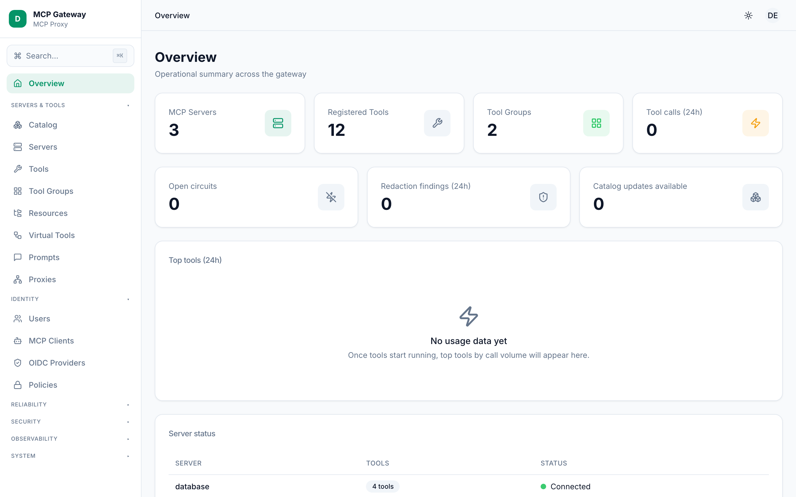
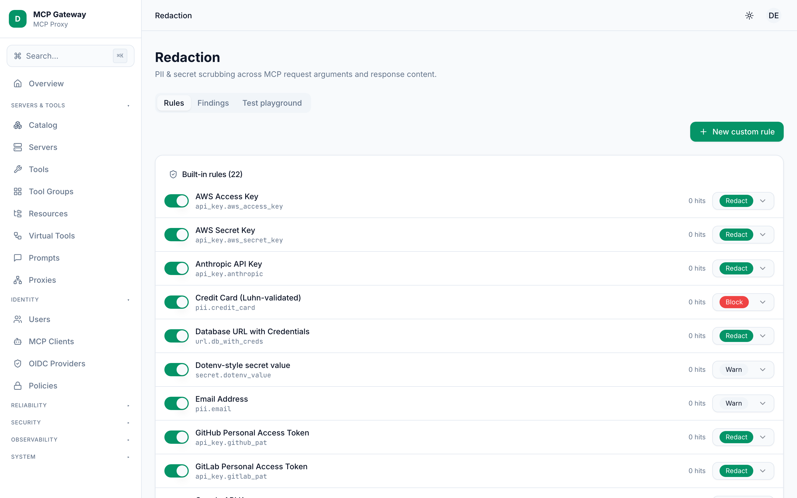
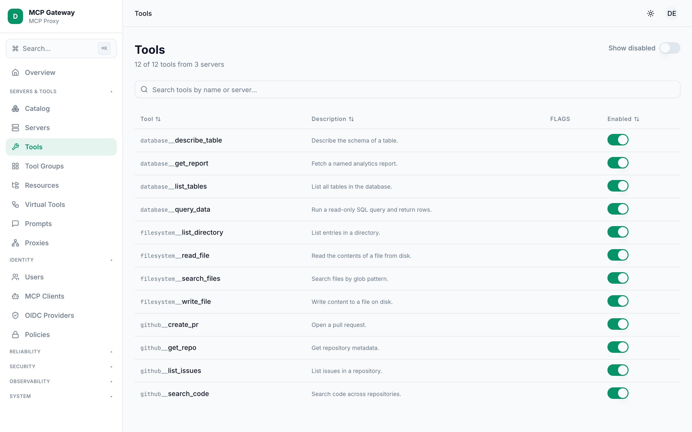
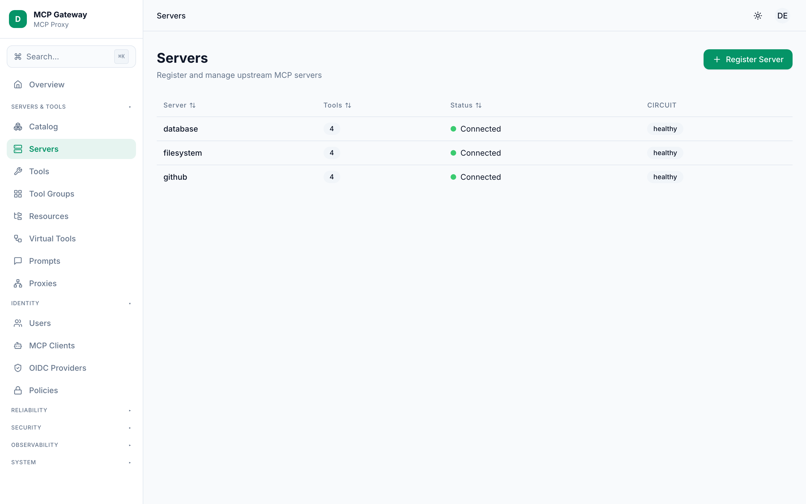
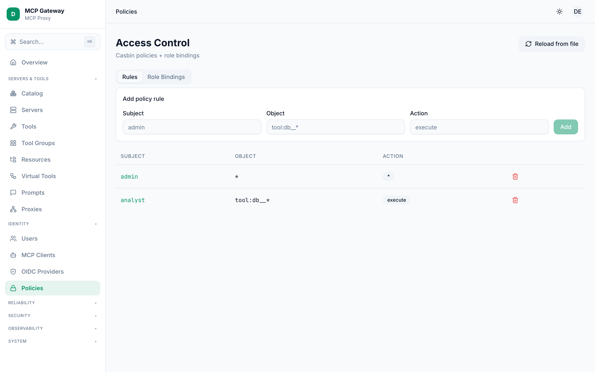
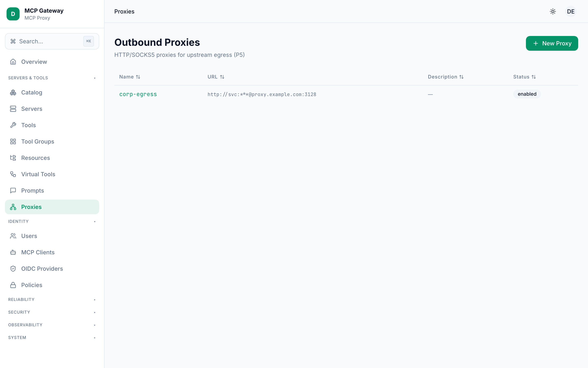
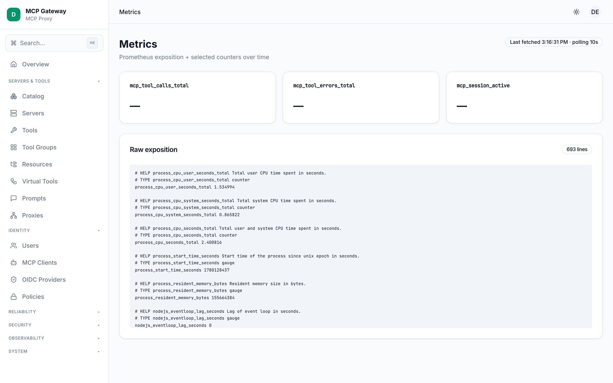
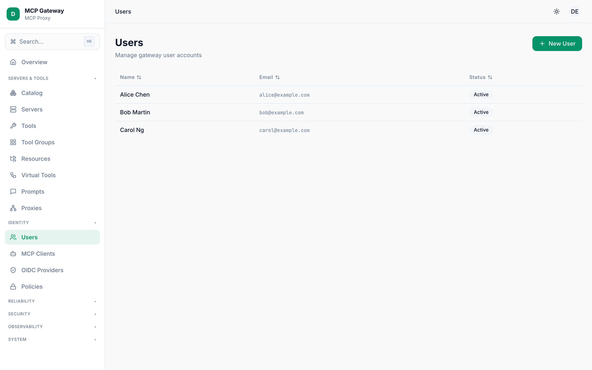

<div align="center">

# 🛡️ MCP Gateway

### One gateway for all your MCP servers — with the auth, access control, and observability that production actually needs.

[](LICENSE)
[](package.json)
[](https://www.typescriptlang.org/)
[](https://modelcontextprotocol.io/)
[](https://github.com/cuongdev/mcp-gateway/releases)

A self-hosted **Model Context Protocol (MCP) gateway / proxy** that puts every upstream MCP server behind **one endpoint** — with **OIDC authentication**, **fine-grained access control (RBAC/ABAC/ReBAC)**, **circuit breaking**, **PII/secret redaction**, a **42-connector catalog**, and a full **admin dashboard**.



</div>

---

## 💡 Why MCP Gateway?

Connecting AI agents (Claude, Cursor, VS Code…) to MCP servers one-by-one doesn't scale: every client re-configures every server, there's no central auth, no access control, no audit trail, and one flaky upstream can hang everything.

**MCP Gateway** sits in the middle and gives you a single control plane:

- 🔌 **Register once, use everywhere** — agents connect to one `/mcp` endpoint; the gateway fans out to all upstreams.
- 🔐 **Real authentication** — OIDC/SSO login + session cookies + personal access tokens, not just static API keys.
- 🛂 **Fine-grained authorization** — Casbin RBAC/ABAC/ReBAC decides exactly who can call which tool.
- 🧰 **Curated tool surfaces** — expose only the tools an agent needs via scoped group endpoints, cutting context-window pollution.
- 🩺 **Stays up** — per-server circuit breaker + health probes isolate failing upstreams automatically.
- 🕵️ **Stays safe** — built-in PII/secret redaction scrubs tool arguments and responses; approval gates protect sensitive tools.
- 📊 **Stays observable** — Prometheus metrics, OpenTelemetry tracing, JSONL audit logs, and per-principal usage stats.

> Already using **MCPJungle**? See the [honest side-by-side comparison](#-mcp-gateway-vs-mcpjungle) below.

---

## ✨ Features

| | |
|---|---|
| 🔌 **Unified MCP endpoint** | One `/mcp` for all upstreams. Canonical `server__tool` naming keeps names globally unique. |
| 🧰 **Tool Groups** | Curated, role-gated subsets of tools, each on its own endpoint (`/mcp/groups/:name`). |
| 🔐 **OIDC + Sessions + PATs** | SSO login via any OIDC provider, signed session cookies, and personal access tokens. |
| 🛂 **Casbin RBAC/ABAC/ReBAC** | Policy-file access control down to the individual tool. |
| 🩺 **Circuit Breaker** | Per-server state machine (`healthy → degraded → open → half-open`) + background probe recovery. |
| 🕵️ **PII / Secret Redaction** | 22 built-in rules (AWS, GitHub, Stripe, JWT, PEM, credit cards…) with `redact / block / warn` modes. |
| ✅ **Approval Workflows** | Mark tools `sensitive` → calls require admin approval before execution. |
| 🧩 **Virtual Tools** | Compose multiple upstream tools into one declarative DAG meta-tool. |
| 📦 **Connector Catalog** | 42 ready-to-install server templates with a guided install wizard. |
| 🚦 **Rate Limit · Quota · Cache** | Per-principal sliding-window limits, daily/monthly quotas, and tool-call caching (memory / SQL / Redis). |
| 🌐 **Outbound Proxy Mgmt** | Route upstream calls through named HTTP/HTTPS/SOCKS5 proxies. |
| 🏢 **Multi-tenancy** | Tenant isolation with per-tenant scoping. |
| 📊 **Observability** | Prometheus metrics + OpenTelemetry traces + JSONL audit + usage analytics. |
| 🖥️ **Admin Dashboard** | A full web UI for everything above. |

---

## 📸 Dashboard Tour

<table>
  <tr>
    <td width="50%"><b>📦 Connector Catalog</b><br/>42 one-click server templates.<br/></td>
    <td width="50%"><b>🕵️ PII / Secret Redaction</b><br/>22 built-in rules, redact/block/warn.<br/></td>
  </tr>
  <tr>
    <td width="50%"><b>🧰 Tools</b><br/>Canonical <code>server__tool</code> naming.<br/></td>
    <td width="50%"><b>🩺 Servers &amp; Circuit Health</b><br/>Live status + circuit-breaker state.<br/></td>
  </tr>
  <tr>
    <td width="50%"><b>🛂 Policies (Casbin)</b><br/>Fine-grained RBAC/ABAC rules.<br/></td>
    <td width="50%"><b>🌐 Outbound Proxies</b><br/>Inline credentials auto-redacted.<br/></td>
  </tr>
  <tr>
    <td width="50%"><b>📊 Metrics</b><br/>Prometheus exposition + live counters.<br/></td>
    <td width="50%"><b>👥 Identity</b><br/>Users, MCP clients, tokens, OIDC.<br/></td>
  </tr>
</table>

---

## 🆚 MCP Gateway vs MCPJungle

Both projects solve the same core problem — *"one place to manage and connect to all your MCP servers."* [MCPJungle](https://github.com/mcpjungle/MCPJungle) is a mature, popular, **Go** single-binary gateway. MCP Gateway is a **TypeScript** gateway focused on **enterprise security, governance, and resilience**.

> The table reflects MCPJungle as of its **v0.4.5** (per its public docs/README) and MCP Gateway **v0.8.0**. Corrections welcome via PR.

| Capability | 🛡️ MCP Gateway | 🌿 MCPJungle |
|---|:---:|:---:|
| Language / distribution | TypeScript (Node ≥ 20) | **Go (single binary)** |
| Unified `/mcp` endpoint | ✅ | ✅ |
| Canonical `server__tool` naming | ✅ | ✅ |
| Tool Groups (scoped endpoints) | ✅ updatable, prompts included | ✅ no updates, no prompts in groups |
| Transports | streamable-HTTP, stdio | streamable-HTTP, stdio, SSE *(immature)* |
| **Client / user authentication** | **OIDC/SSO + session cookies + PATs** | Static bearer tokens only *(no OAuth/OIDC)* |
| **Authorization model** | **Casbin RBAC / ABAC / ReBAC** | admin/user roles + per-client allow-lists |
| Upstream auth | bearer token, custom headers | bearer, headers, **upstream OAuth (beta)** |
| **Circuit breaker + health probes** | ✅ | — *(not documented)* |
| **PII / secret redaction** | ✅ 22 rules | ❌ |
| **Approval workflows** | ✅ | ❌ |
| **Virtual tools (composition)** | ✅ DAG | ❌ |
| **Rate limit · quota · cache** | ✅ | — *(not documented)* |
| **Outbound proxy management** | ✅ | ❌ |
| **Multi-tenancy** | ✅ | ❌ |
| Connector catalog | ✅ 42 templates + installer | register via config files |
| MCP spec coverage | tools, prompts, resources, completion, logging, roots | tools, prompts, resources |
| Observability | Prometheus + **OTel tracing** + **JSONL audit** + usage | Prometheus metrics + `/health` |
| Admin dashboard | ✅ | ✅ |
| Maturity | newer (v0.8.0) | **mature** (~1k★, releasing since 2025) |
| License | MIT | MPL-2.0 |

**Choose MCP Gateway when** you need OIDC/SSO user login, fine-grained RBAC/ABAC, audit trails, PII redaction, circuit breaking, approval gates, or multi-tenancy — i.e. **production governance & security**.

**Choose MCPJungle when** you want a lightweight, battle-tested **Go single binary**, the smallest possible footprint, or its **browser-based upstream-OAuth** auto-negotiation. It's a great, more mature option for simpler setups.

*MCPJungle is excellent work and the inspiration for this project — this comparison is about fit, not winners.*

---

## 🚀 Quick Start

> Requires **Node.js >= 20**.

```bash
# Clone
git clone https://github.com/cuongdev/mcp-gateway.git
cd mcp-gateway

# Install dependencies
npm install

# Copy the env template and adjust as needed
cp .env.example .env

# Development mode (no auth, full access)
npm run dev

# Web dashboard (separate Vite dev server)
npm run dev:web

# Enterprise mode (OIDC + strict ACL)
GATEWAY_MODE=enterprise \
OIDC_DISCOVERY_URL=https://your-provider/.well-known/openid-configuration \
OIDC_CLIENT_ID=mcp-gateway \
OIDC_AUDIENCES=mcp-gateway \
GATEWAY_SESSION_SECRET="$(openssl rand -hex 32)" \
npm run dev
```

### Production build & CLI

```bash
npm run build              # compile to dist/ + bundle the web dashboard
npm start                  # run the compiled gateway
./bin/mcp-gateway --help   # admin CLI: register servers, manage tools/policies/catalog, etc.
```

---

## 🧩 Key Concepts

**Canonical Tool Naming** — every tool is exposed as `server-name__tool-name`, so names stay globally unique across servers (`filesystem__read_file`, `database__query_data`).

**Tool Groups** — curated subsets of tools with dedicated MCP endpoints. An agent on `/mcp/groups/data-analyst` only sees data tools, reducing context-window pollution.

**Dual Mode** — *Development* (no auth, full access, console logging) for local use; *Enterprise* (OIDC, strict Casbin ACL, file audit, metrics) for production.

**Session Manager** — abstracts transport differences: HTTP servers use `fetch`; STDIO servers use persistent child processes with idle timeouts.

---

## 📡 API Reference

### MCP Endpoints (for AI agents)

| Method   | Path                  | Description                       |
|----------|-----------------------|-----------------------------------|
| `POST`   | `/mcp`                | MCP JSON-RPC (all tools)          |
| `GET`    | `/mcp`                | SSE stream (server notifications) |
| `DELETE` | `/mcp`                | Close MCP session                 |
| `POST`   | `/mcp/groups/:name`   | Group-scoped MCP JSON-RPC         |

### Admin REST API (for developers)

| Method   | Path                          | Description                     |
|----------|-------------------------------|---------------------------------|
| `GET`    | `/api/health`                 | Gateway health check            |
| `GET`    | `/api/metrics`                | Prometheus metrics              |
| `GET`    | `/api/servers`                | List registered servers         |
| `POST`   | `/api/servers`                | Register a new MCP server       |
| `DELETE` | `/api/servers/:name`          | Deregister a server             |
| `POST`   | `/api/servers/:name/sync`     | Re-discover tools from server   |
| `GET`    | `/api/tools`                  | List all tools (canonical names)|
| `PUT`    | `/api/tools/:name/enable`     | Enable a tool                   |
| `PUT`    | `/api/tools/:name/disable`    | Disable a tool                  |
| `GET`    | `/api/groups`                 | List tool groups                |
| `POST`   | `/api/groups`                 | Create a tool group             |
| `GET`    | `/api/groups/:name`           | Get group details               |
| `PUT`    | `/api/groups/:name`           | Update a group                  |
| `DELETE` | `/api/groups/:name`           | Delete a group                  |
| `GET`    | `/api/policies`               | List Casbin policies            |
| `POST`   | `/api/policies`               | Add a policy rule               |
| `POST`   | `/api/policies/reload`        | Reload policies from file       |
| `POST`   | `/api/roles`                  | Assign role to user             |

---

## ⚙️ Configuration

### Server Registration

```json
{
  "servers": [
    {
      "name": "my-db",
      "transport": {
        "type": "streamable-http",
        "url": "http://localhost:8002/mcp",
        "bearerToken": "optional-token"
      },
      "autoDiscover": true
    },
    {
      "name": "local-tools",
      "transport": {
        "type": "stdio",
        "command": "node",
        "args": ["./my-mcp-server.js"],
        "stateful": true
      }
    }
  ]
}
```

### Tool Groups

```json
{
  "groups": [
    {
      "name": "data-analyst",
      "description": "Read-only data tools",
      "tools": ["my-db__query_data", "my-db__get_report"],
      "allowedRoles": ["analyst", "admin"]
    }
  ]
}
```

### Access Control (Casbin)

Edit `config/policy.csv`:

```csv
p, admin, *, *
p, analyst, tool:database__*, execute
p, user, tool:filesystem__read_file, execute

g, admin, analyst
g, analyst, user
g, alice@example.com, admin
```

---

## 📚 Documentation

- [Architecture](ARCHITECTURE.md) — components, request flow, module layout
- [Connector Catalog](docs/guides/catalog.md)
- [Circuit Breaker](docs/guides/circuit-breaker.md)
- [PII / Secret Redaction](docs/guides/redaction.md)
- [Virtual Tools](docs/guides/virtual-tools.md)
- [MCP Spec Coverage](docs/guides/mcp-spec-coverage.md)
- [Migration from v0.1](docs/guides/migration-from-v0.1.md)

---

## 🗒️ Release Highlights

### v0.8.0 — Pipeline Platform

Five user-visible features built on a unified foundation:

- **Circuit Breaker** — per-server state machine + probe-loop recovery; `mcp_circuit_*` metrics; `/circuits` dashboard.
- **PII / Secret Redaction** — 22 built-in rules, `redact/block/warn` modes, custom per-tenant rules, `safe-regex` validation; `/redaction` dashboard.
- **Full MCP Spec Coverage** — resources, prompts, completion, logging, roots in addition to tools.
- **Connector Catalog** — 42 seed templates, atomic installer with env validation + rollback; `/catalog` install wizard.
- **Virtual Tools** — declarative DAG composition of upstream tools, AJV-validated plans; `/virtual-tools` editor.

<details>
<summary><b>Earlier releases (v0.3 – v0.7)</b></summary>

- **v0.7.0-p5 — Outbound proxies:** named HTTP/HTTPS/SOCKS5 proxies with 3-level precedence, password redaction, fail-closed routing.
- **v0.6.0-p4 — Multi-tenancy:** `tenants` table, `X-Tenant` resolution middleware, system admin API, `tenant_id` scoping.
- **v0.5.0-p3 — Differentiation:** approval workflow, webhook dispatcher (HMAC-signed), OpenAPI 3.x → MCP adapter with SSRF guard.
- **v0.4.0-p2 — Hardening:** OIDC↔Principal unification, rate limiting, quotas, tool-call caching, OpenTelemetry tracing.
- **v0.3.0-p1 — Parity:** MCP client provisioning, user accounts + PATs, prompt registry, usage stats, Postgres adapter, full CLI.

</details>

---

## 🛠️ Tech Stack

**Hono** (HTTP) · **jose** (JWT/OIDC) · **Casbin** (policy engine) · **Pino** (logging) · **prom-client** (metrics) · **Zod** (config) · **React + Vite** (dashboard) · **libSQL / Postgres** (storage)

---

## 📄 License

[MIT](LICENSE) © Cuong Tuan Nguyen

<div align="center">
<sub>Inspired by <a href="https://github.com/mcpjungle/MCPJungle">MCPJungle</a> · Built with TypeScript</sub>
</div>
