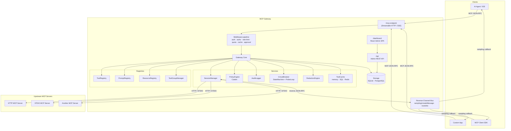
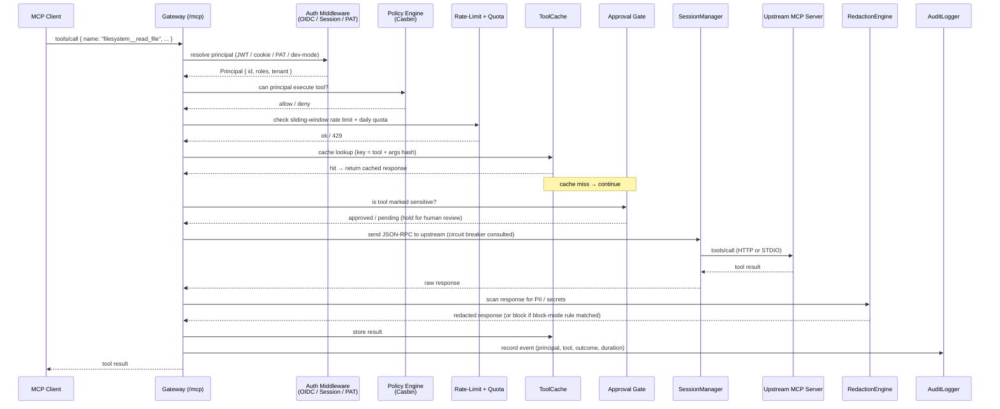

# Architecture

MCP Gateway is a proxy and control-plane that sits between MCP clients (AI agents, IDE extensions, custom applications) and one or more upstream MCP servers. Every tool call, prompt fetch, and resource read flows through the gateway, where it is authenticated, authorized, rate-limited, optionally cached, and — on response — optionally redacted before being returned to the client.

---

## Topology

The gateway exposes a single unified MCP endpoint (default `/mcp`) to clients. Internally it maintains persistent sessions to each registered upstream server, using either Streamable HTTP or spawned STDIO child processes.



**Tool Groups** (`/mcp/groups/:name`) are scoped endpoints that expose only a curated subset of tools. An agent connecting to `/mcp/groups/data-analyst` sees only the tools configured for that group, reducing context-window pollution.

---

## Request flow: tool call

The following sequence shows what happens when an MCP client calls a tool (e.g. `filesystem__read_file`):



---

## Core concepts

### Servers

A **Server** is a registered upstream MCP process. It is identified by a name (e.g. `filesystem`) and has one of two transport types:

- **`streamable-http`** / **`sse`** — gateway connects over HTTP; the upstream URL, optional bearer token, and session mode (`stateful` / `stateless`) are configured per server.
- **`stdio`** — gateway spawns a child process (`command` + `args`); the process is kept alive with an idle timeout managed by `SessionManager`.

### Tools

Each upstream server exposes its own tool names. The gateway prefixes them with the server name using double underscores: `filesystem__read_file`, `database__query_data`. This **canonical naming** keeps tool names globally unique across all registered servers.

### Capabilities: Prompts and Resources

Beyond tools, the gateway proxies MCP **Prompts** (templated prompt fragments) and **Resources** (file or data references). These are tracked in `PromptRegistry` and `ResourceRegistry` alongside `ToolRegistry`, and are served through the same `/mcp` endpoint.

### Tool Groups

A **Tool Group** is a named, curated subset of tools (and optionally prompts/resources) exposed on its own MCP endpoint at `/mcp/groups/:name`. Groups support `allowedRoles` for Casbin-gated access and `includedServers`/`excludedTools` for fine-grained composition.

### Identity and Principals

The gateway resolves a **Principal** (the acting identity) from one of three credential types per request:

| Credential | Mechanism |
|---|---|
| OIDC token | Bearer JWT validated against the configured OIDC discovery URL |
| Session cookie | Signed `mcp_session` cookie issued after OIDC login via `/auth` |
| Personal Access Token (PAT) | Long-lived token issued via the admin API |

In `development` mode without OIDC configured, a dev-mode principal is injected with full admin access.

### Policies and Authorization

Authorization is handled by **Casbin** (RBAC/ABAC/ReBAC). The model file (`config/policy.model.conf`) defines the policy language; the policy file (`config/policy.csv`) lists rules:

```csv
p, admin, *, *
p, analyst, tool:database__*, execute
p, user, tool:filesystem__read_file, execute

g, alice@example.com, admin
g, analyst, user
```

`PolicyEngine` checks every incoming tool/prompt/resource call against this policy. The `defaultDecision` in config determines whether unmatched calls are denied or allowed.

### Sessions

`SessionManager` owns the lifecycle of all upstream connections:

- **HTTP transports**: uses `fetch` with per-server timeout and optional `Mcp-Session-Id` header (stateful mode).
- **STDIO transports**: spawns child processes, maintains stdin/stdout pipes, and enforces idle timeouts.
- The **circuit breaker** (`StateMachine`) is consulted on every `send()` call. If a server is in `open` state (too many failures), the call is rejected immediately. A background `ProbeLoop` sends health pings to recover degraded servers.

### Reverse Channel

Some upstream MCP servers initiate **reverse JSON-RPC calls** back toward the client — most notably `sampling/createMessage` (asking the client's LLM to generate text) and `roots/list`. The **`ReverseChannelMux`** wires these reverse requests from the upstream back to the originating MCP client session, and optionally applies redaction to both directions. Successful round-trips are persisted to `sampling_log` for admin audit.

### Rate Limiting, Quotas, and Caching

Three independent controls protect upstream capacity:

| Layer | Description |
|---|---|
| **Rate limit** | Per-principal sliding-window limit (requests per second/minute). Backends: in-memory or Redis. |
| **Quota** | Per-principal daily or monthly call budgets stored in the database. |
| **Cache** | Tool-call results cached by (tool name + args hash). Backends: in-memory, SQL, or Redis. |

All three are mounted as Hono middleware on the `/mcp` path, in order: rate-limit → quota → cache → approval gate.

### Approval Workflows

Tools marked `sensitive` in the registry enter an **Approval Gate** before the upstream call is made. The call is held and a webhook notification is dispatched to configured reviewers. An admin approves or rejects it via the dashboard or REST API before execution proceeds.

### Redaction

`RedactionEngineFactory` creates per-request `RedactionEngine` instances with 22 built-in rules covering AWS keys, GitHub tokens, Stripe secrets, JWTs, PEM blocks, credit card numbers, and more. Each rule has a configurable mode:

- **`redact`** — replace the matched value with a placeholder.
- **`block`** — reject the entire call with an error.
- **`warn`** — log the finding but pass the response through.

Redaction is applied to both forward (tool responses) and reverse-channel (sampling) payloads when `gateway.reverseChannelRedaction` is enabled.

---

## Storage

MCP Gateway uses a single storage abstraction (`StorageAdapter`) that supports two backends:

| Driver | When to use |
|---|---|
| `sqlite` (default) | Local development, single-node deployments. File path set via `storage.path` or `STORAGE_PATH`. |
| `postgres` | Multi-node or production deployments. Connection string via `storage.url` or `DATABASE_URL`. |

The same database stores tool registrations, tool groups, policy data, sessions, audit events, approval requests, quota counters, cache entries, sampling logs, and webhook jobs.

---

## Operating modes

| | `development` | `enterprise` |
|---|---|---|
| OIDC required | No | Yes (warns on startup if absent) |
| Casbin authorization | Optional | Always on |
| Secure session cookie | No | Yes |
| Audit log | Optional | Always on |
| Prometheus metrics | Optional | Always on |
| Dev-mode login bypass | Available | Disabled |

---

## See also

- [Getting Started](./getting-started.md)
- [Servers & Tools](./servers-and-tools.md)
- [Identity](./identity.md)
- [Policies](./identity.md#policies)
