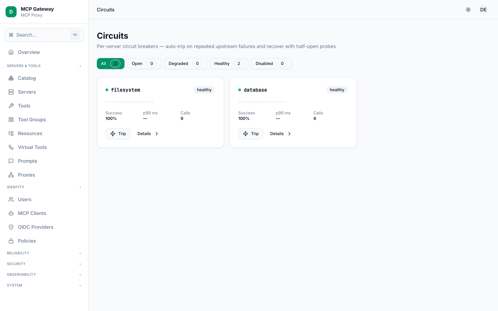
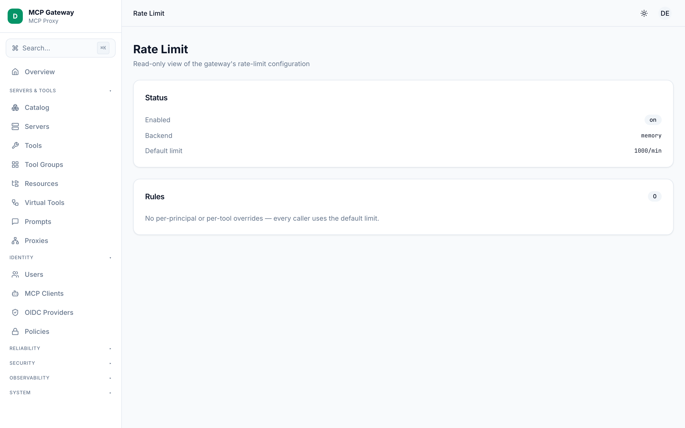
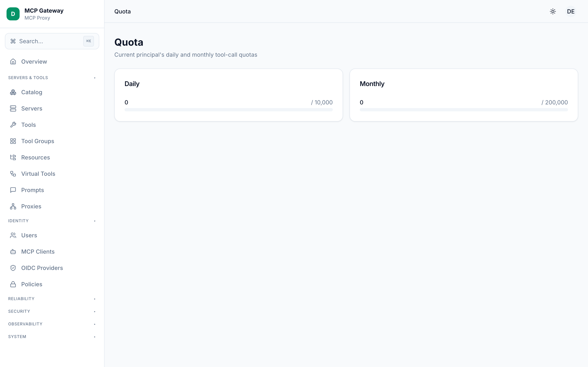
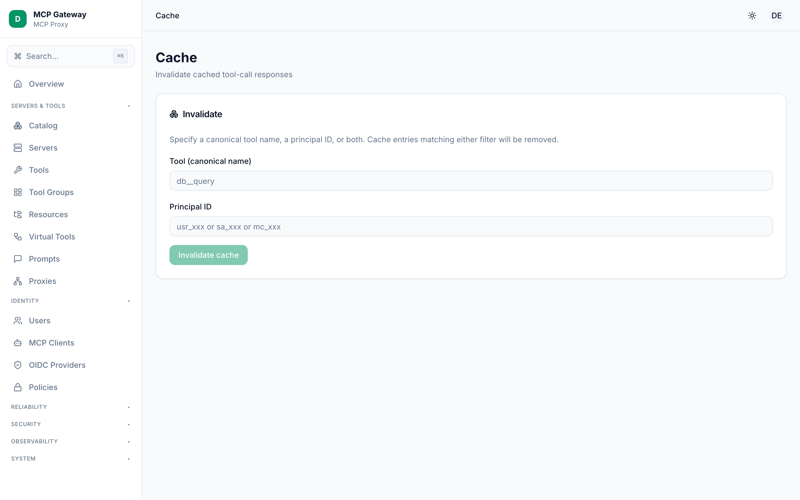
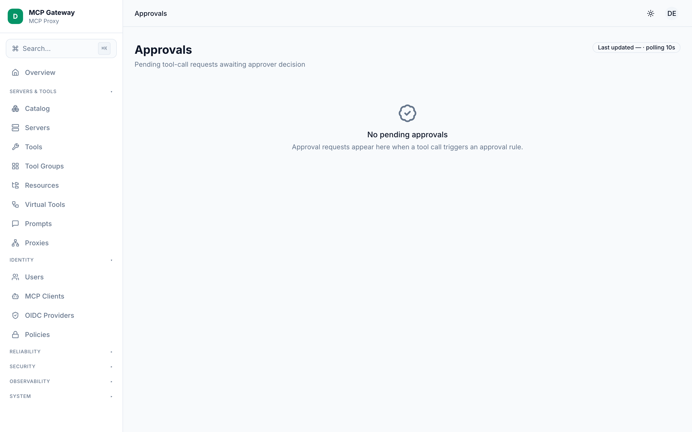

# Reliability

The Reliability section of the MCP Gateway dashboard provides five controls that protect the gateway, its upstream MCP servers, and the clients that call them. Together they form a defence-in-depth stack: circuit breakers stop cascading failures at the server level; rate limits and quotas cap per-principal consumption; caching reduces redundant upstream calls; and approval workflows gate sensitive tool invocations before they execute.

**Screens in this section:**

- [Circuits](#circuits) — per-server circuit breaker state machine
- [Rate Limit](#rate-limit) — request-rate policy and current rules
- [Quota](#quota) — daily and monthly tool-call quotas for the current principal
- [Cache](#cache) — tool-response cache management and invalidation
- [Approvals](#approvals) — human-in-the-loop approval of sensitive tool calls

---

## Circuits

The Circuits screen shows the circuit breaker state for every MCP server the gateway has contacted. A circuit breaker prevents the gateway from hammering a failing upstream: once a server's error rate or consecutive-error count exceeds the configured threshold, the circuit trips to `circuit_open` and subsequent calls fail fast until the cooldown elapses and a half-open probe succeeds.

### How to use

1. Open **Reliability > Circuits** in the left sidebar.
2. Use the filter bar at the top to narrow results by state: **All**, **Open**, **Degraded**, **Healthy**, or **Disabled**. Each button shows the count of servers in that state.
3. Locate a server card of interest and click it to open the **detail sheet** on the right.
4. In the detail sheet, review the **Current state** badge and the `lastTransitionReason` annotation beneath it.
5. Inspect the **Recent calls** sparkline to see the rolling window of successes and failures.
6. To override the circuit breaker configuration for that server, fill in one or more fields in the **Config override** section and click **Save config override**.
7. Use **Manual actions** to intervene directly:
   - **Trip** — forces the circuit to `circuit_open` immediately (available when the circuit is not already open or quarantined).
   - **Close** — returns the circuit to `healthy` (available when the state is `circuit_open`, `quarantined`, or `manual_disabled`).
   - **Reset counters** — zeros the rolling window and consecutive error count; state returns to `healthy`. A confirmation dialog is shown before the action executes.

### State reference

| State | Meaning |
|---|---|
| `healthy` | Requests pass through normally; error counters accumulating |
| `degraded` | Error rate or consecutive errors are rising but have not yet crossed the trip threshold |
| `circuit_open` | All requests fail fast; gateway waits for the cooldown period before probing |
| `half_open` | Cooldown elapsed; a single probe request is allowed to test the upstream |
| `quarantined` | The circuit has re-opened more times than `quarantineAfterReopens`; remains open until manually closed |
| `manual_disabled` | An administrator explicitly disabled the server via the dashboard |

### Config fields

| Field | Default | Description |
|---|---|---|
| `errorRateThreshold` | `0.5` | Fraction of calls in the rolling window that must fail to trip the circuit (0–1) |
| `windowSize` | `20` | Number of recent calls tracked in the rolling window |
| `consecutiveErrorsToTrip` | `5` | Number of back-to-back errors that trip the circuit regardless of error rate |
| `cooldownMs` | `30000` | Milliseconds to wait in `circuit_open` before attempting a half-open probe |
| `halfOpenProbes` | `1` | Number of probe calls allowed in `half_open` state |
| `quarantineAfterReopens` | `3` | Number of times the circuit may re-open before entering `quarantined` |
| `warmupCalls` | `5` | Minimum calls required before the error rate is evaluated |
| `probeMethod` | `tools/list` | MCP method used as the half-open health probe |

> **Tip:** Circuits initialise lazily after the first call to each upstream server. A fresh gateway shows an empty list until at least one proxied call has been made.

---

## Rate Limit

The Rate Limit screen displays the gateway's active rate-limit configuration — the enabled state, storage backend, default limit, and any per-principal or per-tool overrides. Rate limiting caps how many requests a given caller can make within a time window, protecting upstream servers from bursts and ensuring fair usage across all clients.

### How to use

1. Open **Reliability > Rate Limit** in the left sidebar.
2. The **Status** card shows three read-only fields:
   - **Enabled** — whether rate limiting is active for this gateway instance.
   - **Backend** — the storage backend in use (`memory` or `redis`).
   - **Default limit** — the limit applied to any caller that does not match a specific rule (format: `N/sec`, `N/min`, `N/hour`, or `N/day`).
3. The **Rules** card lists every configured override. Each row shows the scope of the rule and the effective limit:
   - A `principalType` badge (`user`, `service_account`, or `mcp_client`) scopes the rule by principal category.
   - A `principalId` code scopes the rule to a specific caller.
   - A `tool:` prefix indicates the rule applies only to calls for that tool name (supports `*` wildcards).
   - The limit to the right of the arrow (`→`) is the effective cap for matching callers.
4. If the **Rules** card shows "No per-principal or per-tool overrides", every caller uses the default limit.

> **Note:** Rate-limit rules are configured in the gateway's configuration file, not through the dashboard UI. This screen is a read-only view of the running configuration. To change limits, update the config and reload the gateway.

### Limit format

Limits use the format `N/unit` where `unit` is one of `sec`, `min`, `hour`, or `day`. For example, `100/min` allows 100 calls per minute. The most specific matching rule wins; `principalId` carries higher specificity than `principalType`.

---

## Quota

The Quota screen shows the current principal's daily and monthly tool-call usage against their configured quota limits. While rate limiting enforces a per-window request rate, quotas enforce absolute usage ceilings that reset on a calendar boundary (midnight UTC for daily; first of the month UTC for monthly).

### How to use

1. Open **Reliability > Quota** in the left sidebar.
2. Two cards are displayed side by side: **Daily** and **Monthly**.
3. Each card shows:
   - The number of tool calls **used** in the current period (displayed as `used / limit`).
   - A colour-coded progress bar: green below 70 %, amber from 70–89 %, and red at 90 % or above.
   - `/ unlimited` if no limit is configured for that period.
4. If the endpoint returns an error or the current session is unauthenticated, an empty state is shown instead.

> **Note:** The Quota screen reflects the usage of the currently authenticated principal (the identity whose API token was used to open the dashboard session). It does not show quota for other principals. To inspect or override quotas for specific principals, edit the gateway configuration file.

### Reset schedule

| Period | Resets at |
|---|---|
| Daily | Midnight UTC each day |
| Monthly | 00:00 UTC on the first day of the next month |

---

## Cache

The Cache screen allows administrators to invalidate entries in the tool-response cache. Caching stores the responses of deterministic tool calls keyed on the tool name, its arguments, and the calling principal, so that identical repeat calls are served from cache without hitting the upstream server. This reduces latency and lowers upstream load.

### How to use

1. Open **Reliability > Cache** in the left sidebar.
2. In the **Invalidate** card, enter one or both of the following filters:
   - **Tool (canonical name)** — the fully-qualified tool name (for example, `db__query`). All cache entries for this tool across all principals will be removed.
   - **Principal ID** — the ID of a specific caller (for example, `usr_xxx`, `sa_xxx`, or `mc_xxx`). All cache entries created by this principal will be removed.
3. Click **Invalidate cache**. The button is disabled until at least one field contains a value.
4. On success, a toast notification confirms the number of entries removed.

> **Tip:** You can enter both a tool name and a principal ID at the same time. Entries matching either filter are removed (union, not intersection).

### Cache backends

The gateway supports three cache backends, selected at configuration time:

| Backend | Description |
|---|---|
| `memory` | In-process LRU-style map; entries are lost on restart. Configurable via `maxEntries`. |
| `sql` | Entries stored in the gateway's libSQL/SQLite database; survives restarts. |
| `redis` | Entries stored in Redis; survives restarts and is shared across gateway replicas. |

Cache entries expire automatically after `defaultTtlSec` seconds (configured gateway-side). Use the Invalidate action for immediate, targeted eviction before the TTL expires.

---

## Approvals

The Approvals screen presents pending human-approval requests for sensitive tool calls. When a policy requires approval before a tool executes, the gateway holds the call in a pending state and notifies the dashboard. An administrator reviews the call details and either approves or rejects it. Approvals act as a human-in-the-loop gate for high-impact or irreversible operations.

### How to use

1. Open **Reliability > Approvals** in the left sidebar. The page auto-refreshes every 10 seconds and on window focus.
2. Each pending request is shown as a card containing:
   - The **tool name** (in `monospace`) and its current `status` badge.
   - The **principal ID** that requested the call and the time remaining before the request expires.
   - A collapsible **arguments** block — click "View args" to expand the JSON arguments that would be passed to the tool.
3. Optionally enter a reason in the **Optional reason** text area.
4. Click **Approve** (green check) to allow the tool call to proceed, or **Reject** (red X) to deny it. Both actions require the current session to be authenticated.
5. On success, a toast confirms the decision and the card disappears from the pending list.
6. If no pending approvals exist, an empty state is shown. Approvals are generated only when live MCP traffic hits a policy that requires approval — a fresh gateway will show an empty list.

### Approval fields

| Field | Description |
|---|---|
| `id` | Unique approval request identifier (prefix `app_`) |
| `tool` | Canonical name of the tool awaiting approval |
| `principalId` | ID of the caller that triggered the approval request |
| `argsJson` | JSON-serialised arguments that would be passed to the tool |
| `status` | `pending` while awaiting a decision |
| `tsExpires` | Unix timestamp (ms) after which the request is no longer actionable |

> **Note:** The API currently supports filtering by `status=pending` only. Approved and rejected records are stored in the database for audit purposes and are visible in the Audit log.

---

## See also

- [Architecture](./architecture.md)
- [Servers & Tools](./servers-and-tools.md)
- [Security](./security.md)
- [Observability](./observability.md)
