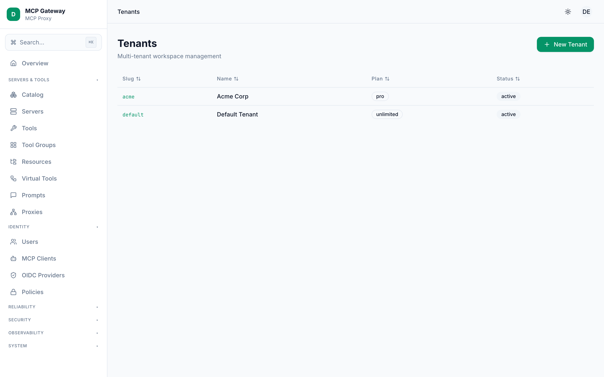
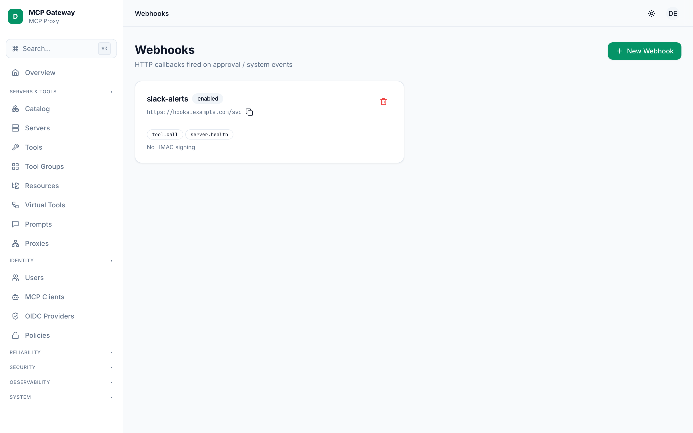
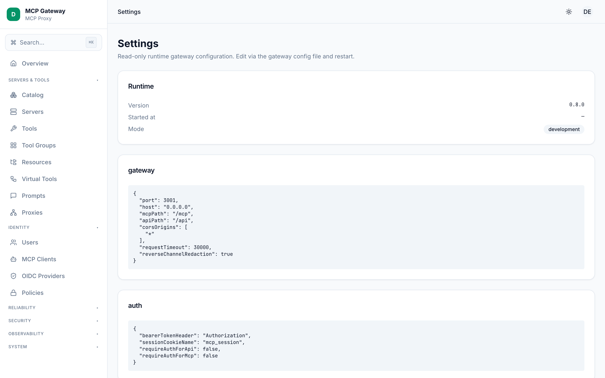

# System

The **System** section of the MCP Gateway dashboard covers the operational concerns that span the entire deployment: tenant isolation, outbound event webhooks, and a read-only view of the running gateway configuration.

**Screens in this section:**

- [Tenants](#tenants) — create and manage isolated workspaces
- [Webhooks](#webhooks) — register outbound HTTP callbacks for gateway events
- [Settings](#settings) — inspect the live runtime configuration (admin only)

---

## Tenants

The Tenants screen lets administrators provision and manage isolated workspaces within the gateway. Each tenant has its own principals, servers, and policies; the built-in `tnt_default` tenant is always present and cannot be deleted.



### How to use

1. Navigate to **System → Tenants** in the sidebar.
2. The table shows all tenants with their **Slug**, **Name**, **Plan**, and **Status** (`active` or `suspended`).
3. To create a tenant, click **New Tenant** (top-right). A slide-out sheet opens with the following fields:

   | Field | Description |
   |---|---|
   | `Slug` | Permanent, URL-safe identifier — lowercase alphanumeric and hyphens, e.g. `acme-corp`. Must be unique. |
   | `Display Name` | Human-readable label shown in the table. |
   | `Plan` | Optional free-text tag used to communicate tier information (e.g. `free`, `enterprise`). |

4. Click **Create** to confirm. The gateway seeds built-in redaction rules for the new tenant automatically.
5. To view or manage a tenant, click its row. A detail sheet opens showing the `slug`, `plan`, current `status`, and any `metadata` JSON stored on the record.
6. In the detail sheet's **Lifecycle** section:
   - If the tenant is `active`, click **Suspend tenant** (destructive, red button) to block all requests from that tenant's principals.
   - If the tenant is `suspended`, click **Resume tenant** to restore access.

> **Note:** There is no delete action for tenants. Suspend a tenant to prevent access without removing its data.

### API endpoints

| Method | Path | Description |
|---|---|---|
| `GET` | `/api/tenants` | List all tenants |
| `POST` | `/api/tenants` | Create a tenant |
| `PATCH` | `/api/tenants/:id/suspend` | Suspend a tenant |
| `PATCH` | `/api/tenants/:id/resume` | Resume a tenant |

---

## Webhooks

The Webhooks screen lets you register outbound HTTP callbacks that the gateway calls whenever a configured event fires. The gateway delivers event payloads via `POST` and optionally signs each request with an HMAC-SHA256 signature so your endpoint can verify authenticity.



### How to use

1. Navigate to **System → Webhooks** in the sidebar.
2. Registered webhooks appear as cards showing the webhook **Name**, **URL**, enabled/disabled badge, subscribed event badges, and HMAC signing status.
3. To register a webhook, click **New Webhook**. A slide-out sheet opens:

   | Field | Description |
   |---|---|
   | `Name` | A human-readable label for this webhook. |
   | `URL` | The HTTPS endpoint the gateway will `POST` events to. |
   | `Events` | One or more event names to subscribe to (chip input with autocomplete). Leave empty to receive all events. |
   | `Secret` | Optional. When provided, the gateway signs the request body with HMAC-SHA256 and sends the signature in the `X-MCP-Signature` header as `sha256=<hex>`. |

4. Click **Create** to save. The webhook is immediately active.
5. To delete a webhook, click the trash icon on its card and confirm the dialog. Future events will no longer be delivered to that URL.

### Event types

| Event name | Fired when |
|---|---|
| `approval.requested` | A tool call is held for human approval |
| `approval.approved` | An approval request is granted |
| `approval.rejected` | An approval request is denied |
| `approval.expired` | An approval request times out |
| `tool.called` | A tool call is proxied through the gateway |
| `quota.exceeded` | A principal hits their call quota limit |
| `server.state.changed` | A circuit-breaker state transition occurs |
| `redaction.block` | A redaction rule blocks an MCP call |
| `catalog.installed` | A cataloged server is installed |
| `catalog.uninstalled` | A cataloged server is removed |
| `virtual-tool.changed` | A virtual tool is created or updated |

### HMAC signature verification

When a `Secret` is configured, validate incoming requests on your endpoint:

```
X-MCP-Signature: sha256=<hex-digest>
```

Compute `HMAC-SHA256(secret, raw-request-body)` and compare. Reject any request where the signatures do not match.

### Retry behavior

The dispatcher retries failed deliveries with exponential back-off up to a configured maximum number of attempts. Delivery outcomes are persisted so the gateway can resume retries after a restart.

### API endpoints

| Method | Path | Description |
|---|---|---|
| `GET` | `/api/webhooks` | List all webhooks |
| `GET` | `/api/webhooks/events` | List known event names |
| `POST` | `/api/webhooks` | Create a webhook |
| `DELETE` | `/api/webhooks/:id` | Delete a webhook |

---

## Settings

The Settings screen displays a read-only snapshot of the running gateway configuration. It is admin-gated: users without the `admin` role see an "unavailable" state instead. To change configuration, edit the gateway config file and restart the process.



### How to use

1. Navigate to **System → Settings** in the sidebar.
2. The **Runtime** card at the top shows process-level metadata:

   | Field | Description |
   |---|---|
   | `Version` | The deployed gateway version string. |
   | `Started at` | ISO timestamp of when the gateway process started. |
   | `Mode` | The operating mode (e.g. `standalone`, `cluster`). |

3. Below the Runtime card, each configuration section appears as a separate card with a JSON code block. Sections shown depend on which keys are present in the loaded config:

   | Section | Contents |
   |---|---|
   | `gateway` | Core HTTP listener settings |
   | `auth` | Authentication provider settings |
   | `authorization` | Role-based access control settings |
   | `storage` | Database adapter settings |
   | `rateLimit` | Per-principal rate-limit rules |
   | `quota` | Call quota configuration |
   | `cache` | Response cache settings |
   | `approval` | Human-in-the-loop approval settings |
   | `webhooks` | Webhook dispatcher settings |
   | `tracing` | OpenTelemetry / tracing settings |
   | `openapi` | OpenAPI spec exposure settings |
   | `proxy` | Outbound HTTP/SOCKS5 proxy settings |
   | `tenancy` | Multi-tenancy settings |
   | `oidcProviders` | OIDC provider definitions |

4. All secret fields (e.g. `clientSecret`, tokens, passwords) are replaced with `***` by the `redactConfig` function before being sent to the browser.

> **Tip:** If you see the "Settings unavailable" empty state, your account does not have the `admin` role, or the `/api/system/info` endpoint is unreachable.

### API endpoint

| Method | Path | Description |
|---|---|---|
| `GET` | `/api/system/info` | Return redacted runtime config — admin only |

---

## See also

- [Architecture](./architecture.md)
- [Identity](./identity.md)
- [Observability](./observability.md)
- [Servers & Tools](./servers-and-tools.md)
