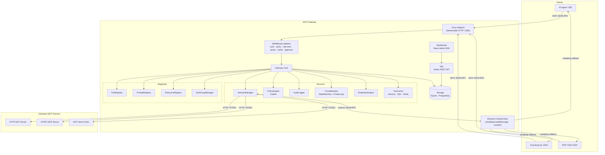
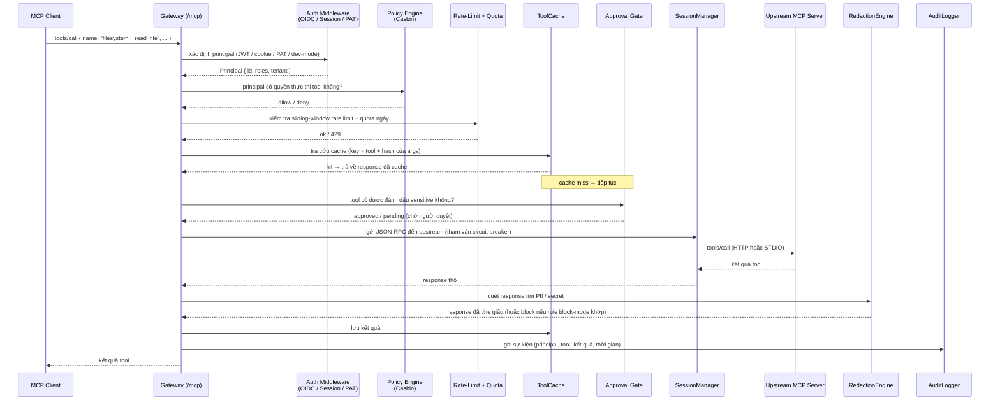

# Kiến trúc

MCP Gateway là một proxy và control-plane nằm giữa các MCP client (AI agent, tiện ích mở rộng IDE, ứng dụng tùy chỉnh) và một hoặc nhiều MCP server upstream. Mỗi lời gọi tool, truy vấn prompt, và đọc resource đều đi qua gateway, tại đó chúng được xác thực, phân quyền, giới hạn tốc độ, tùy chọn lưu cache, và — ở chiều response — tùy chọn che giấu dữ liệu trước khi trả về cho client.

---

## Tô-pô hệ thống

Gateway mở ra một MCP endpoint thống nhất (mặc định `/mcp`) cho các client. Nội bộ, nó duy trì các phiên kết nối bền vững đến mỗi server upstream đã đăng ký, sử dụng Streamable HTTP hoặc tiến trình con STDIO.



**Tool Groups** (`/mcp/groups/:name`) là các endpoint có phạm vi giới hạn, chỉ mở ra một tập con được tuyển chọn của các tool. Một agent kết nối tới `/mcp/groups/data-analyst` chỉ thấy các tool được cấu hình cho nhóm đó, giảm thiểu lãng phí context window.

---

## Luồng xử lý yêu cầu: lời gọi tool

Sơ đồ sau mô tả quá trình xảy ra khi một MCP client gọi một tool (ví dụ `filesystem__read_file`):



---

## Các khái niệm cốt lõi

### Servers (Máy chủ)

Một **Server** là một tiến trình MCP upstream đã đăng ký. Nó được định danh bằng một tên (ví dụ `filesystem`) và có một trong hai loại transport:

- **`streamable-http`** / **`sse`** — gateway kết nối qua HTTP; URL upstream, bearer token tùy chọn, và chế độ phiên (`stateful` / `stateless`) được cấu hình riêng cho từng server.
- **`stdio`** — gateway spawn tiến trình con (`command` + `args`); tiến trình được giữ sống với idle timeout do `SessionManager` quản lý.

### Tools (Công cụ)

Mỗi server upstream mở ra các tool với tên riêng của nó. Gateway thêm tiền tố tên server bằng hai dấu gạch dưới: `filesystem__read_file`, `database__query_data`. **Đặt tên canonical** này giữ cho tên tool luôn duy nhất trên toàn bộ các server đã đăng ký.

### Capabilities: Prompts và Resources

Ngoài tool, gateway còn proxy **Prompts** (đoạn prompt dạng template) và **Resources** (tham chiếu đến file hoặc dữ liệu) của MCP. Chúng được theo dõi trong `PromptRegistry` và `ResourceRegistry` song song với `ToolRegistry`, và được phục vụ qua cùng endpoint `/mcp`.

### Tool Groups (Nhóm tool)

Một **Tool Group** là một tập con được đặt tên, tuyển chọn các tool (và tùy chọn prompts/resources) được mở ra trên endpoint MCP riêng tại `/mcp/groups/:name`. Group hỗ trợ `allowedRoles` để kiểm soát truy cập bằng Casbin và `includedServers`/`excludedTools` để tùy chỉnh thành phần chi tiết.

### Identity và Principals (Danh tính)

Gateway xác định một **Principal** (danh tính đang hành động) từ một trong ba loại thông tin xác thực per request:

| Thông tin xác thực | Cơ chế |
|---|---|
| OIDC token | Bearer JWT được xác thực với OIDC discovery URL đã cấu hình |
| Session cookie | Cookie `mcp_session` được ký sau khi đăng nhập OIDC qua `/auth` |
| Personal Access Token (PAT) | Token tồn tại lâu dài được cấp qua admin API |

Trong chế độ `development` không có OIDC, một dev-mode principal được tự động gán với quyền admin đầy đủ.

### Policies và Authorization (Chính sách và Phân quyền)

Phân quyền được xử lý bởi **Casbin** (RBAC/ABAC/ReBAC). File model (`config/policy.model.conf`) định nghĩa ngôn ngữ chính sách; file policy (`config/policy.csv`) liệt kê các quy tắc:

```csv
p, admin, *, *
p, analyst, tool:database__*, execute
p, user, tool:filesystem__read_file, execute

g, alice@example.com, admin
g, analyst, user
```

`PolicyEngine` kiểm tra mọi lời gọi tool/prompt/resource đến với chính sách này. `defaultDecision` trong cấu hình xác định liệu các lời gọi không khớp có bị từ chối hay cho phép.

### Sessions (Phiên kết nối)

`SessionManager` quản lý vòng đời của tất cả các kết nối upstream:

- **HTTP transport**: sử dụng `fetch` với timeout per-server và header `Mcp-Session-Id` tùy chọn (chế độ stateful).
- **STDIO transport**: spawn tiến trình con, duy trì pipe stdin/stdout, và áp dụng idle timeout.
- **Circuit breaker** (`StateMachine`) được tham vấn mỗi lần gọi `send()`. Nếu server đang ở trạng thái `open` (quá nhiều lỗi), lời gọi bị từ chối ngay lập tức. `ProbeLoop` chạy ngầm gửi ping sức khỏe để phục hồi các server bị suy giảm.

### Reverse Channel (Kênh ngược)

Một số MCP server upstream khởi tạo **lời gọi JSON-RPC ngược** trở về client — đặc biệt là `sampling/createMessage` (yêu cầu LLM của client tạo văn bản) và `roots/list`. **`ReverseChannelMux`** định tuyến các yêu cầu ngược này từ upstream về đúng phiên MCP client gốc, và tùy chọn áp dụng redaction cho cả hai chiều. Các round-trip thành công được lưu vào `sampling_log` để kiểm toán quản trị.

### Rate Limiting, Quotas và Caching

Ba cơ chế kiểm soát độc lập bảo vệ năng lực upstream:

| Tầng | Mô tả |
|---|---|
| **Rate limit** | Giới hạn sliding-window per-principal (yêu cầu mỗi giây/phút). Backend: in-memory hoặc Redis. |
| **Quota** | Ngân sách lời gọi ngày hoặc tháng per-principal lưu trong database. |
| **Cache** | Kết quả lời gọi tool được cache theo (tên tool + hash của args). Backend: in-memory, SQL, hoặc Redis. |

Cả ba được gắn kết là Hono middleware trên path `/mcp`, theo thứ tự: rate-limit → quota → cache → approval gate.

### Approval Workflows (Quy trình phê duyệt)

Các tool được đánh dấu `sensitive` trong registry sẽ đi qua **Approval Gate** trước khi lời gọi upstream được thực hiện. Lời gọi bị giữ lại và một thông báo webhook được gửi đến người duyệt được cấu hình. Một admin phê duyệt hoặc từ chối qua dashboard hoặc REST API trước khi thực thi được tiến hành.

### Redaction (Che giấu dữ liệu nhạy cảm)

`RedactionEngineFactory` tạo các instance `RedactionEngine` per-request với 22 quy tắc tích hợp sẵn bao gồm AWS key, GitHub token, Stripe secret, JWT, PEM block, số thẻ tín dụng, và nhiều hơn nữa. Mỗi quy tắc có một chế độ có thể cấu hình:

- **`redact`** — thay thế giá trị khớp bằng placeholder.
- **`block`** — từ chối toàn bộ lời gọi với lỗi.
- **`warn`** — ghi log phát hiện nhưng cho response đi qua.

Redaction được áp dụng cho cả response tool (chiều xuôi) và payload reverse-channel (sampling) khi `gateway.reverseChannelRedaction` được bật.

---

## Storage (Lưu trữ)

MCP Gateway sử dụng một abstraction lưu trữ thống nhất (`StorageAdapter`) hỗ trợ hai backend:

| Driver | Khi nào dùng |
|---|---|
| `sqlite` (mặc định) | Phát triển cục bộ, triển khai single-node. Đường dẫn file qua `storage.path` hoặc `STORAGE_PATH`. |
| `postgres` | Triển khai multi-node hoặc production. Chuỗi kết nối qua `storage.url` hoặc `DATABASE_URL`. |

Cùng một database lưu trữ đăng ký tool, tool group, dữ liệu policy, phiên, sự kiện kiểm toán, yêu cầu phê duyệt, bộ đếm quota, cache, sampling log, và webhook job.

---

## Chế độ vận hành

| | `development` | `enterprise` |
|---|---|---|
| Bắt buộc OIDC | Không | Có (cảnh báo khi khởi động nếu thiếu) |
| Casbin authorization | Tùy chọn | Luôn bật |
| Cookie phiên bảo mật | Không | Có |
| Audit log | Tùy chọn | Luôn bật |
| Prometheus metrics | Tùy chọn | Luôn bật |
| Bỏ qua đăng nhập (dev-mode) | Có sẵn | Bị tắt |

---

## Xem thêm

- [Bắt đầu](./getting-started.md)
- [Servers & Tools](./servers-and-tools.md)
- [Identity](./identity.md)
- [Policies](./identity.md#policies)
