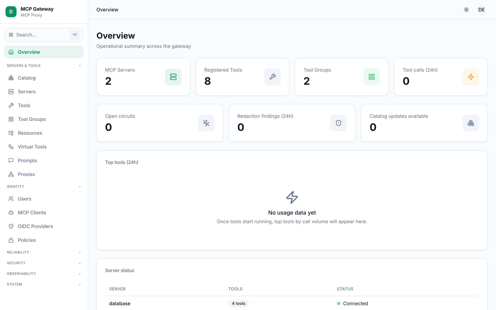

# Bắt đầu với MCP Gateway

MCP Gateway là một proxy và control-plane mã nguồn mở dành cho các [Model Context Protocol](https://modelcontextprotocol.io) (MCP) server. Gateway nằm giữa các MCP client (AI agent, tiện ích mở rộng IDE, ứng dụng tùy chỉnh) và một hoặc nhiều MCP server upstream, bổ sung xác thực, phân quyền, giới hạn tốc độ, che giấu dữ liệu nhạy cảm, và một bảng quản trị đầy đủ — mà không cần thay đổi bất kỳ dòng code nào trong client hay server hiện có.

---

## Yêu cầu

- **Node.js >= 20.0.0** (kiểm tra bằng `node --version`)
- **npm** (đi kèm với Node.js)
- Git (để clone repository)

---

## 1. Cài đặt

Clone repository và cài đặt các phụ thuộc:

```bash
git clone https://github.com/cuongdev/mcp-gateway.git
cd mcp-gateway
npm install
```

---

## 2. Build

Biên dịch mã nguồn TypeScript và đóng gói React dashboard:

```bash
npm run build
```

Lệnh này thực hiện ba bước tuần tự:

| Bước | Tác dụng |
|---|---|
| `tsc` | Biên dịch `src/` sang `dist/` |
| `build:assets` | Sao chép SQL migration và catalog JSON vào `dist/` |
| `build:web` | Build Vite dashboard và đặt tại `dist/dashboard/` |

---

## 3. Cấu hình

MCP Gateway được cấu hình qua một file JSON. Sao chép template phát triển để bắt đầu:

```bash
cp config/gateway.config.json config/my-gateway.json
```

File mặc định `config/gateway.config.json` thể hiện thiết lập tối giản cho môi trường phát triển:

```json
{
  "mode": "development",
  "gateway": {
    "port": 3100,
    "host": "0.0.0.0",
    "mcpPath": "/mcp",
    "apiPath": "/api",
    "corsOrigins": ["*"],
    "requestTimeout": 30000
  },
  "servers": [
    {
      "name": "filesystem",
      "transport": {
        "type": "stdio",
        "command": "npx",
        "args": ["-y", "@modelcontextprotocol/server-filesystem", "/tmp"]
      }
    }
  ],
  "authorization": {
    "enabled": false
  },
  "audit": {
    "enabled": true,
    "storage": "console"
  }
}
```

### Chế độ Development và Enterprise

Trường `"mode"` điều khiển mức độ bảo mật của gateway:

| | `development` | `enterprise` |
|---|---|---|
| Xác thực OIDC | Tùy chọn (tắt nếu không cấu hình provider) | Bắt buộc (cảnh báo khi khởi động nếu thiếu) |
| Phân quyền Casbin | Tùy chọn | Luôn được áp dụng |
| Cookie phiên bảo mật | Tiêu chuẩn | Bắt buộc cờ `Secure` |
| Ghi log kiểm toán | Có thể cấu hình | Luôn bật |
| Prometheus metrics | Có thể cấu hình | Luôn bật |
| Đăng nhập Dashboard | Nút "Enter as Admin (Dev Mode)" có sẵn | Chỉ qua OIDC |

Với enterprise, xem `config/gateway.enterprise.json` để tham khảo đầy đủ. Tối thiểu bạn cần:

```json
{
  "mode": "enterprise",
  "oidcProviders": [
    {
      "id": "my-provider",
      "discoveryUrl": "https://your-provider.com/.well-known/openid-configuration",
      "clientId": "mcp-gateway",
      "clientSecret": "..."
    }
  ],
  "authorization": {
    "enabled": true,
    "modelFile": "./config/policy.model.conf",
    "policyFile": "./config/policy.csv",
    "defaultDecision": "deny"
  }
}
```

### Biến môi trường hữu ích

Tất cả biến môi trường đều ghi đè lên giá trị tương ứng trong file cấu hình khi khởi động. Các biến thường dùng nhất:

| Biến | Khóa cấu hình | Mô tả |
|---|---|---|
| `GATEWAY_MODE` | `mode` | `development` hoặc `enterprise` |
| `GATEWAY_PORT` | `gateway.port` | Cổng HTTP lắng nghe (mặc định `3100`) |
| `GATEWAY_HOST` | `gateway.host` | Địa chỉ bind (mặc định `0.0.0.0`) |
| `GATEWAY_CONFIG` | — | Đường dẫn đến file cấu hình |
| `GATEWAY_SESSION_SECRET` | `session.secret` | Bí mật để ký session cookie |
| `STORAGE_DRIVER` | `storage.driver` | `sqlite` (mặc định) hoặc `postgres` |
| `STORAGE_PATH` | `storage.path` | Đường dẫn đến file SQLite |
| `DATABASE_URL` | `storage.url` | Chuỗi kết nối PostgreSQL |
| `OIDC_DISCOVERY_URL` | `oidcProviders[0].discoveryUrl` | OIDC well-known URL |
| `OIDC_CLIENT_ID` | `oidcProviders[0].clientId` | OIDC client ID |
| `OIDC_CLIENT_SECRET` | `oidcProviders[0].clientSecret` | OIDC client secret |
| `AUTHZ_MODEL_FILE` | `authorization.modelFile` | Đường dẫn đến file model Casbin |
| `AUTHZ_POLICY_FILE` | `authorization.policyFile` | Đường dẫn đến file policy Casbin CSV |
| `AUDIT_ENABLED` | `audit.enabled` | `true` / `false` |

---

## 4. Chạy gateway

```bash
npm start
```

Lệnh này thực thi `node dist/index.js`. Bạn có thể truyền đường dẫn cấu hình tùy chỉnh dưới dạng đối số vị trí hoặc qua `GATEWAY_CONFIG`:

```bash
# Đối số vị trí
node dist/index.js ./config/my-gateway.json

# Biến môi trường
GATEWAY_CONFIG=./config/my-gateway.json npm start

# Chế độ enterprise với OIDC qua biến môi trường
GATEWAY_MODE=enterprise \
  OIDC_DISCOVERY_URL=https://your-provider/.well-known/openid-configuration \
  OIDC_CLIENT_ID=mcp-gateway \
  GATEWAY_SESSION_SECRET="$(openssl rand -hex 32)" \
  npm start
```

Để phát triển cục bộ (với hot-reload), dùng:

```bash
npm run dev          # gateway với tsx watch
npm run dev:web      # Vite dev server cho dashboard (terminal riêng)
```

---

## 5. Truy cập Dashboard

Mở trình duyệt tại `http://localhost:3100/dashboard`.



Trong **chế độ development**, dashboard hiển thị nút "Enter as Admin (Dev Mode)" — nhấn vào để đăng nhập mà không cần thông tin xác thực. Tính năng này có chủ đích chỉ dùng cho phát triển cục bộ và không bao giờ khả dụng ở chế độ `enterprise`.

Trong **chế độ enterprise**, trang đăng nhập chuyển hướng bạn qua OIDC provider đã cấu hình. Sau khi xác thực, dashboard trình bày toàn bộ giao diện quản trị: quản lý server, duyệt tool, cấu hình group, quản lý danh tính và chính sách, log kiểm toán, metrics, và nhiều hơn nữa.

---

## Các bước tiếp theo

- [Kiến trúc](./architecture.md) — hiểu cách gateway hoạt động bên trong
- [Servers & Tools](./servers-and-tools.md) — đăng ký MCP server upstream và quản lý tool
- [Identity](./identity.md) — cấu hình OIDC provider, PAT, và tùy chọn phiên
- [Policies](./identity.md#policies) — viết quy tắc Casbin RBAC/ABAC cho kiểm soát truy cập chi tiết

---

## Xem thêm

- [Kiến trúc](./architecture.md)
- [Servers & Tools](./servers-and-tools.md)
- [Identity](./identity.md)
- [Policies](./identity.md#policies)
