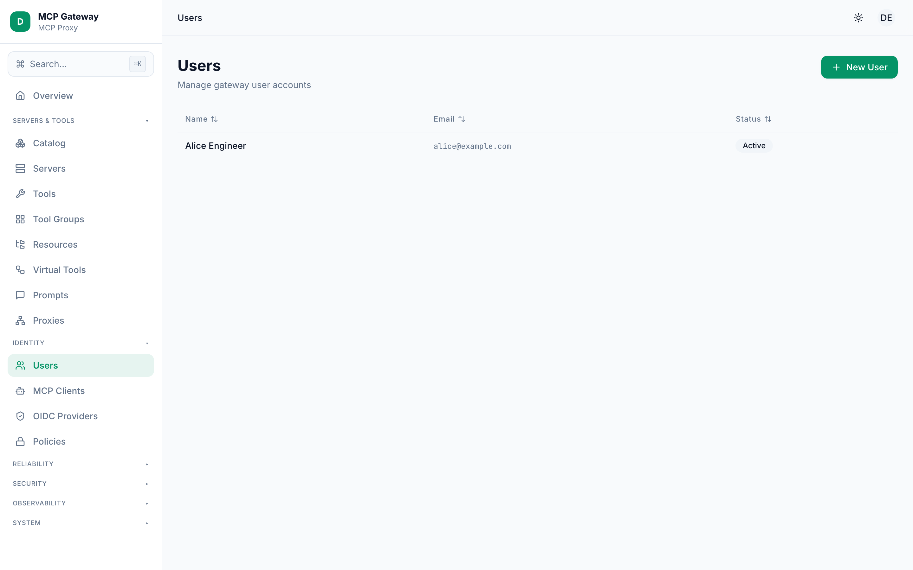
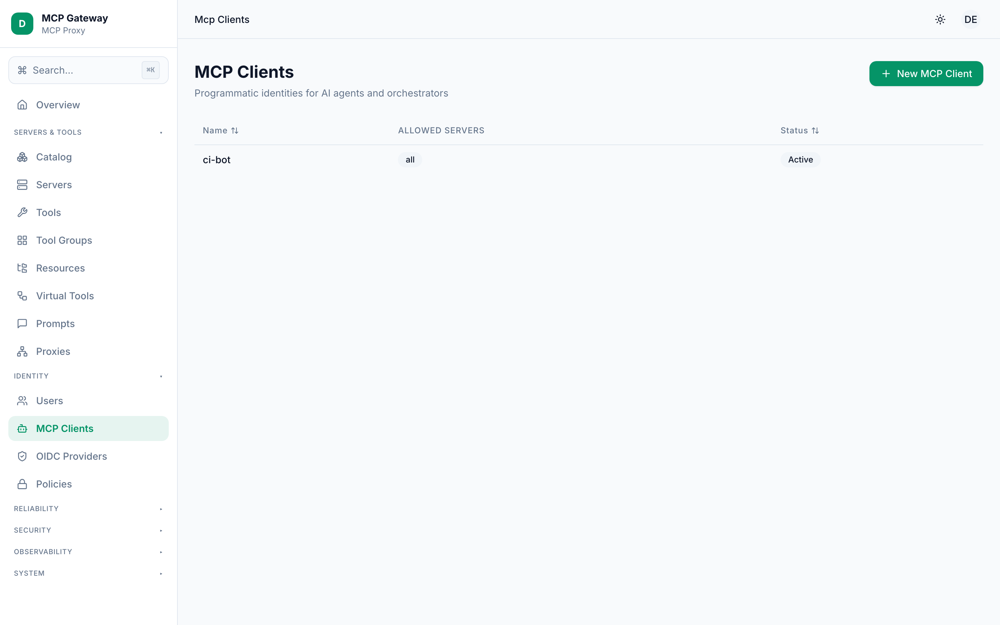
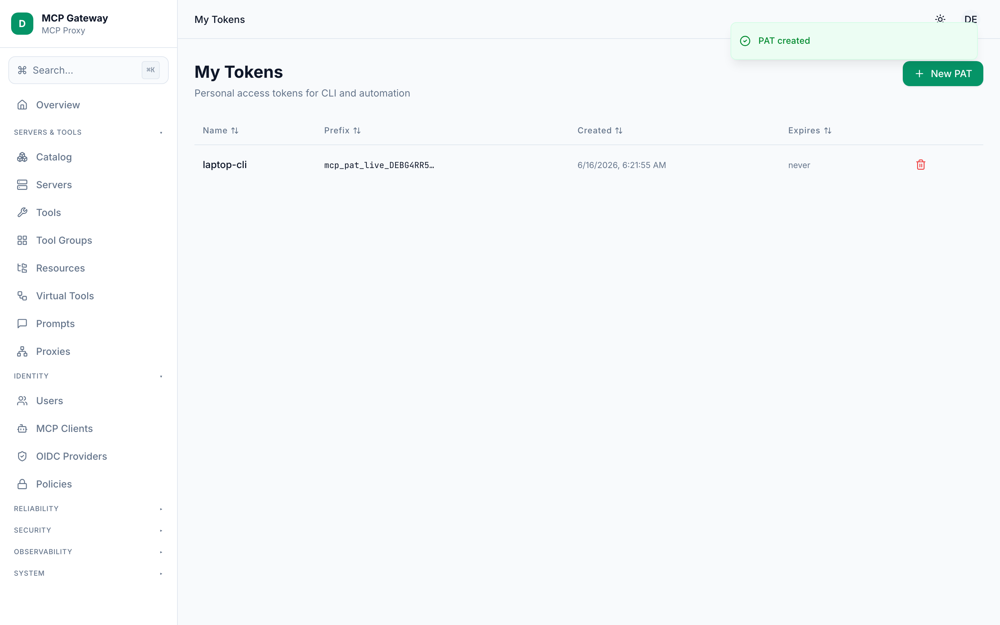
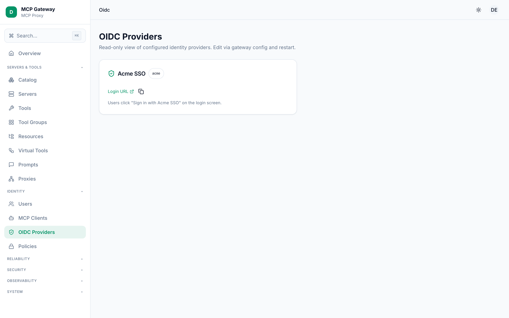
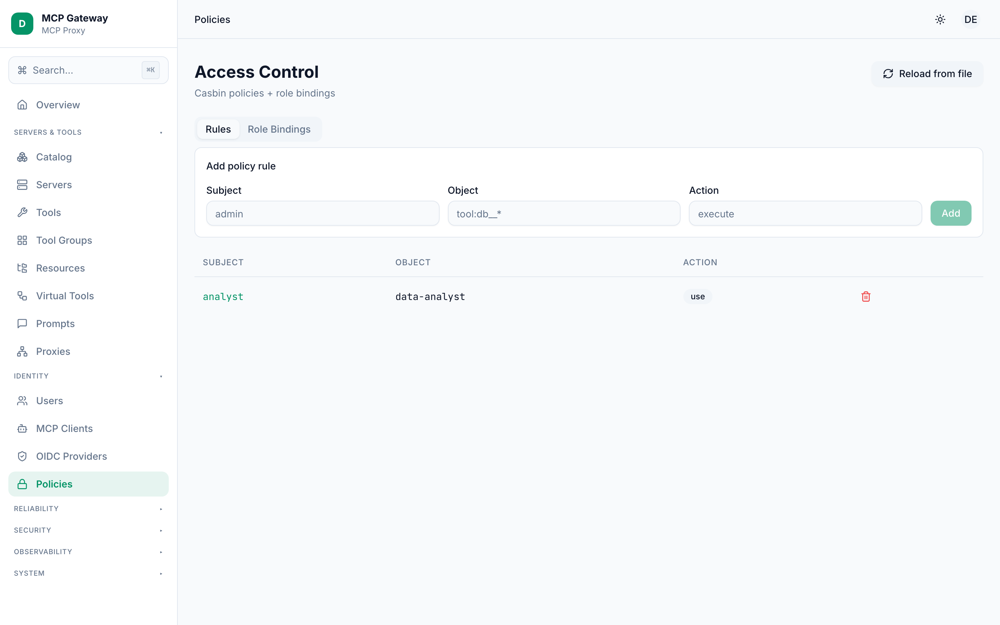

# Danh tính & Quyền truy cập

MCP Gateway sử dụng một mô hình principal thống nhất để xác thực và phân quyền. Mỗi thực thể tương tác với gateway — một người dùng đăng nhập qua nhà cung cấp danh tính, một script sử dụng personal access token, hay một AI agent xác thực bằng thông tin đăng nhập máy — đều được biểu diễn dưới dạng **principal** với một trong ba kiểu: `user`, `service_account`, hoặc `mcp_client`. Quyết định truy cập được đánh giá bởi engine Casbin RBAC dựa trên các quy tắc policy và role binding mà bạn quản lý trong phần này.

**Các màn hình trong phần này:**

- [Users](#users)
- [MCP Clients](#mcp-clients)
- [My Tokens](#my-tokens)
- [OIDC Providers](#oidc-providers)
- [Policies](#policies)

---

## Users

Quản lý tài khoản người dùng trong gateway. Người dùng xác thực bằng cách đăng nhập qua OIDC provider (đăng nhập một lần qua trình duyệt) hoặc bằng cách cung cấp Personal Access Token (PAT) họ đã tạo từ màn hình [My Tokens](#my-tokens).

### Cách sử dụng

1. Điều hướng đến **Identity → Users** trong thanh sidebar.
2. Bảng liệt kê tất cả principal kiểu `user`, hiển thị cột **Name**, **Email**, và **Status** (`Active` / `Disabled`).
3. Nhấp vào bất kỳ hàng nào để mở bảng chi tiết của người dùng đó.
4. Để tạo người dùng mới, nhấp **New User** (góc trên bên phải).

#### Tạo người dùng

1. Nhấp **New User**. Một panel trượt ra xuất hiện.
2. Điền **Email** (phải là địa chỉ email hợp lệ) và **Display name**.
3. Nhấp **Create**. Gateway tạo một principal kiểu `user` và trả về `principalId` mới. Người dùng có thể xác thực qua OIDC hoặc tạo PAT.

#### Xem và quản lý người dùng

1. Nhấp vào một hàng trong bảng.
2. Panel chi tiết hiển thị email, tên hiển thị và trạng thái hiện tại của người dùng.
3. Dùng công tắc **Active** để bật hoặc tắt tài khoản. Người dùng bị tắt sẽ không thể xác thực bằng bất kỳ phương thức nào cho đến khi được bật lại.
4. Để xóa vĩnh viễn tài khoản, nhấp **Hard delete user** trong mục **Danger zone** rồi xác nhận. Thao tác xóa cứng sẽ lan tầng xuống toàn bộ PAT và Casbin role binding thuộc người dùng đó. Hãy dùng **Disable** nếu bạn muốn thực hiện một thao tác có thể hoàn tác.

### Các trường thông tin

| Trường | Mô tả |
|---|---|
| `Email` | Định danh duy nhất dùng để khớp người dùng trong quá trình đăng nhập OIDC hoặc xác thực PAT. |
| `Display name` | Nhãn hiển thị trong toàn bộ dashboard. |
| `Status` | `Active` (có thể xác thực) hoặc `Disabled` (mọi xác thực đều bị chặn). |
| `principalId` | UUID nội bộ được gán khi tạo; được dùng trong quy tắc policy và các lệnh gọi API. |

---

## MCP Clients

Quản lý các principal kiểu `mcp_client`, đại diện cho AI agent, script tự động hóa hoặc các caller không phải con người khác. Mỗi MCP client được cấp một bearer token khi tạo. Client xác thực bằng cách gửi token này trong header `Authorization: Bearer <token>`.

### Cách sử dụng

1. Điều hướng đến **Identity → MCP Clients** trong thanh sidebar.
2. Bảng liệt kê tất cả principal kiểu `mcp_client` với **Name**, **Description**, **Allowed Servers**, và **Status**.
3. Nhấp vào bất kỳ hàng nào để mở panel chi tiết.
4. Để đăng ký client mới, nhấp **New MCP Client** (góc trên bên phải).

#### Tạo MCP client

1. Nhấp **New MCP Client**. Một panel trượt ra xuất hiện.
2. Điền **Name** (bắt buộc) và tùy chọn **Description**.
3. Trong ô nhập chip **Allowed servers**, nhập ID các server mà client này được phép truy cập. Nhập `*` để cấp quyền truy cập tất cả server đã đăng ký. Gõ ID rồi nhấn Enter để thêm dưới dạng chip.
4. Nhấp **Create**. Gateway tạo token có tiền tố `mct_live_…` và hiển thị **một lần duy nhất** trong hộp thoại tiết lộ token. Hãy sao chép ngay — không thể lấy lại sau khi đóng.

#### Quản lý client hiện có

1. Nhấp vào một hàng client để mở panel chi tiết.
2. Chỉnh sửa **Allowed servers** rồi nhấp **Save allowedServers** để cập nhật các server mà client có thể tiếp cận.
3. Dùng công tắc **Active** để bật hoặc tắt client mà không cần xóa.
4. Nhấp **Rotate token** để vô hiệu hóa token hiện tại và tạo token mới. Token mới được hiển thị một lần trong hộp thoại tiết lộ.
5. Để xóa vĩnh viễn client, nhấp **Delete client** trong **Danger zone** rồi xác nhận. Thao tác này lan tầng xuống toàn bộ token và tham chiếu trong audit log.

### Các trường thông tin

| Trường | Mô tả |
|---|---|
| `Name` | Tên hiển thị của client (cũng được dùng làm tên token ban đầu). |
| `Description` | Ghi chú tùy chọn về mục đích của client. |
| `Allowed servers` | Danh sách ID server (hoặc `*`) mà client này được phép proxy. |
| `Status` | `Active` hoặc `Disabled`. |
| Token prefix | Các ký tự đầu của token hiển thị trong bảng (ví dụ: `mct_live_ab12…`) để nhận dạng mà không lộ secret. |

> **Lưu ý bảo mật:** Token được băm trước khi lưu trữ. Chỉ phần tiền tố được giữ ở dạng plaintext. Nếu bạn mất token, hãy thực hiện rotate — không có cách nào khôi phục giá trị gốc.

---

## My Tokens

Tạo và thu hồi Personal Access Token (PAT) để xác thực bạn — principal `user` đang đăng nhập — với gateway API và CLI. Quản lý PAT chỉ khả dụng với principal kiểu `user`; các principal kiểu `mcp_client` và `service_account` không thể truy cập màn hình này.

### Cách sử dụng

1. Điều hướng đến **Identity → My Tokens** trong thanh sidebar.
2. Bảng liệt kê các PAT đang hoạt động của bạn với các cột: **Name**, **Prefix**, **Created**, và **Expires**.
3. Để tạo token mới, nhấp **New PAT** (góc trên bên phải).
4. Để thu hồi một token, nhấp biểu tượng thùng rác trên hàng tương ứng và xác nhận trong hộp thoại.

#### Tạo token

1. Nhấp **New PAT**. Một panel trượt ra xuất hiện.
2. Nhập **Name** (ví dụ: `laptop-cli`) để nhận dạng token sau này.
3. Tùy chọn nhập **Expires in (days)** — bỏ trống nếu muốn token không hết hạn. Thời hạn được tính từ thời điểm bạn nhấp **Create**.
4. Nhấp **Create**. Token (có tiền tố `pat_live_…`) được hiển thị **một lần duy nhất** trong hộp thoại tiết lộ. Hãy sao chép ngay trước khi đóng.

#### Thu hồi token

1. Tìm token trong bảng theo **Name** hoặc **Prefix**.
2. Nhấp biểu tượng thùng rác bên phải.
3. Xác nhận trong hộp thoại. Thu hồi có hiệu lực ngay lập tức và không thể hoàn tác — token ngừng hoạt động ngay và không thể khôi phục.

### Các trường thông tin

| Trường | Mô tả |
|---|---|
| `Name` | Nhãn bạn chọn khi tạo. |
| `Prefix` | Các ký tự đầu của token để nhận dạng (ví dụ: `pat_live_ab12…`). |
| `Created` | Thời điểm token được tạo. |
| `Expires` | Ngày/giờ hết hạn, hoặc `never` nếu không đặt thời hạn. |

> **Mẹo:** Sử dụng token ngắn hạn cho pipeline CI và token không hết hạn chỉ cho môi trường phát triển cục bộ nơi bạn có thể tự rotate thủ công.

---

## OIDC Providers

Xem các nhà cung cấp danh tính mà gateway sử dụng để đăng nhập một lần qua trình duyệt. Đây là màn hình **chỉ đọc**; các provider được cấu hình trong file config của gateway (mảng `oidcProviders[]`) và có hiệu lực sau khi khởi động lại gateway. Không có thao tác tạo, cập nhật hay xóa nào khả dụng tại runtime.

### Cách sử dụng

1. Điều hướng đến **Identity → OIDC Providers** trong thanh sidebar.
2. Mỗi provider đã cấu hình xuất hiện dưới dạng một card hiển thị:
   - **Tên provider** và **ID** (định danh ngắn dùng trong `loginUrl`).
   - Liên kết **Login URL** (`/auth/login/<id>`) để bắt đầu luồng authorization code + PKCE cho provider đó.
   - Nút **copy** bên cạnh login URL.
3. Nếu không có provider nào được liệt kê, gateway đang chạy ở chế độ development hoặc mảng `oidcProviders` trong file config trống.

#### Thêm hoặc chỉnh sửa provider

Provider không thể được thêm hoặc thay đổi qua dashboard. Để cấu hình provider mới:

1. Chỉnh sửa file config gateway và thêm một mục vào `oidcProviders[]` với các trường bắt buộc: `id`, `name`, `discoveryUrl`, `clientId`, `clientSecret`, và `scopes`.
2. Khởi động lại gateway. Provider mới xuất hiện trên màn hình này ngay khi load lại.

### Các trường thông tin (mỗi card provider)

| Trường | Mô tả |
|---|---|
| `id` | Định danh ngắn dùng trong các URL đăng nhập và callback (ví dụ: `google`). |
| `name` | Tên provider thân thiện hiển thị trên màn hình đăng nhập. |
| `loginUrl` | URL đầy đủ để khởi tạo luồng OIDC: `<publicUrl>/auth/login/<id>`. |

### Luồng xác thực OIDC

Khi người dùng nhấp vào login URL, gateway thực hiện:

1. Tạo cặp PKCE `code_verifier` / `code_challenge` và một `state` ngẫu nhiên.
2. Chuyển hướng trình duyệt đến `authorization_endpoint` của provider.
3. Provider xác thực người dùng và chuyển hướng về `/auth/callback/<id>`.
4. Gateway trao đổi authorization code để lấy ID token, xác minh token, và upsert principal kiểu `user` vào storage.
5. Một session cookie đã ký (hiệu lực 8 giờ) được thiết lập và trình duyệt được chuyển hướng đến dashboard.

---

## Policies

Quản lý các quy tắc Casbin RBAC kiểm soát principal nào có thể thực hiện hành động nào trên tài nguyên nào. Màn hình có hai tab: **Rules** (quy tắc policy dạng `subject, object, action`) và **Role Bindings** (gán người dùng vào các role).

### Cách sử dụng

#### Xem và tải lại policy

1. Điều hướng đến **Identity → Policies** trong thanh sidebar.
2. Tab **Rules** liệt kê tất cả quy tắc `p` (policy) đang hoạt động. Mỗi hàng hiển thị **Subject**, **Object**, và **Action**.
3. Tab **Role Bindings** liệt kê tất cả quy tắc `g` (grouping) hiển thị **User** và **Role**.
4. Nhấp **Reload from file** (góc trên bên phải) để tải lại policy từ storage mà không cần khởi động lại gateway.

#### Thêm quy tắc policy

1. Chọn tab **Rules**.
2. Trong form **Add policy rule** ở trên, điền:
   - **Subject** — principal hoặc role được cấp quyền truy cập (ví dụ: `admin`, `alice@example.com`).
   - **Object** — tài nguyên được bảo vệ (ví dụ: `tool:db__query`, `tool:github__*`).
   - **Action** — thao tác được phép (ví dụ: `execute`).
3. Nhấp **Add**. Quy tắc có hiệu lực ngay lập tức.

#### Xóa quy tắc policy

1. Trong bảng **Rules**, tìm quy tắc cần xóa.
2. Nhấp biểu tượng thùng rác trên hàng đó. Quy tắc bị xóa và enforcer được tải lại.

#### Gán role cho người dùng

1. Chọn tab **Role Bindings**.
2. Trong form **Assign role to user**, nhập **User** (thường là email của người dùng hoặc `principalId`) và tên **Role** (ví dụ: `admin`).
3. Nhấp **Assign**. Binding được lưu dưới dạng quy tắc `g, user, role` trong Casbin.

#### Xóa role binding

1. Trong bảng **Role Bindings**, tìm binding cần xóa.
2. Nhấp biểu tượng thùng rác trên hàng đó. Binding bị xóa ngay lập tức.

### Các khái niệm

| Khái niệm | Mô tả |
|---|---|
| **Subject** (`sub`) | Principal hoặc role được cấp quyền truy cập. Có thể là `principalId`, email hoặc tên role. |
| **Object** (`obj`) | Tài nguyên được bảo vệ. Dùng `tool:<server>__<tool>` cho tool cụ thể, hoặc glob pattern như `tool:db__*`. |
| **Action** (`act`) | Thao tác được phép. Thường là `execute` cho các lệnh gọi MCP tool. |
| **Role binding** | Quy tắc `g, user, role` gán người dùng vào role, cho phép kế thừa quy tắc policy theo role. |
| **Reload** | Buộc policy engine đọc lại các quy tắc từ storage. Dùng sau khi import hàng loạt hoặc chỉnh sửa file policy từ bên ngoài. |

> **Mẹo:** Gán các quy tắc rộng cho role (ví dụ: cấp cho role `admin` quyền `*, *, execute`) rồi gán người dùng cụ thể vào các role đó, thay vì viết quy tắc cho từng người dùng. Cách này giúp kiểm soát truy cập dễ kiểm tra và bảo trì hơn.

---

## Xem thêm

- [Kiến trúc](./architecture.md)
- [Servers & Tools](./servers-and-tools.md)
- [Độ tin cậy](./reliability.md)
- [Hệ thống](./system.md)
