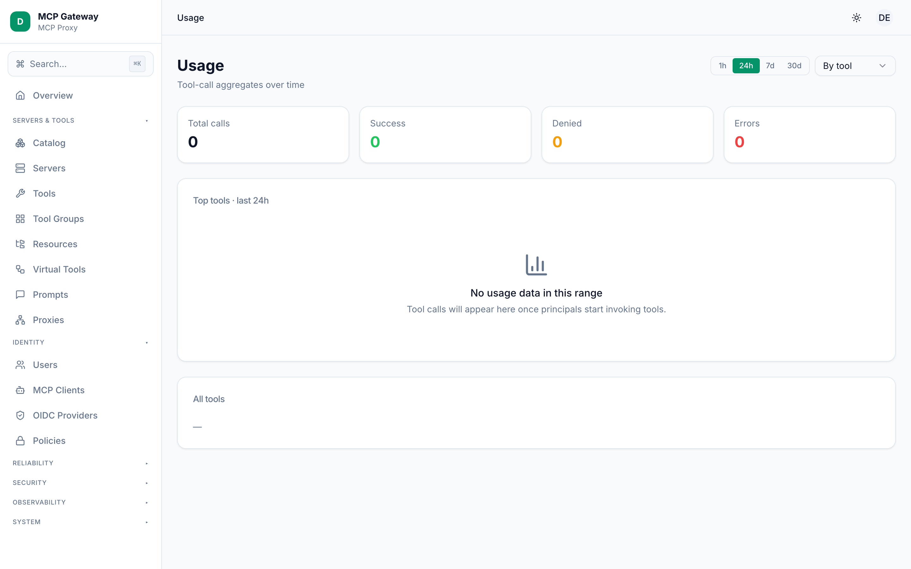
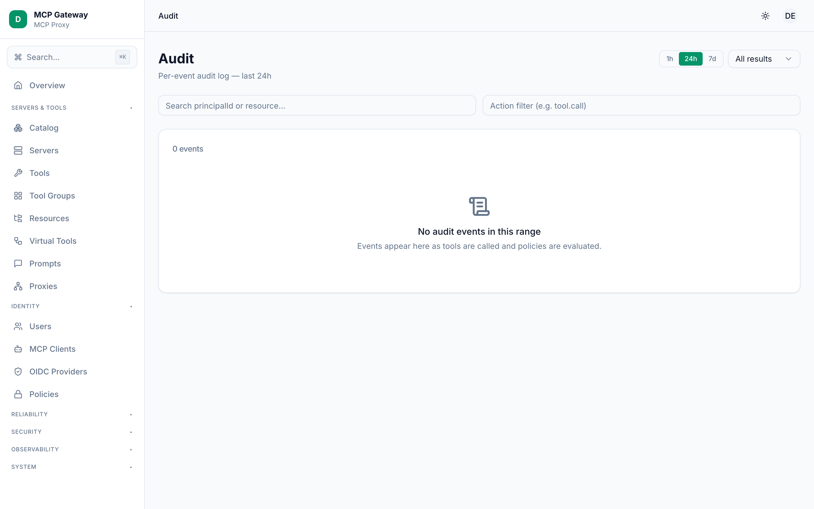
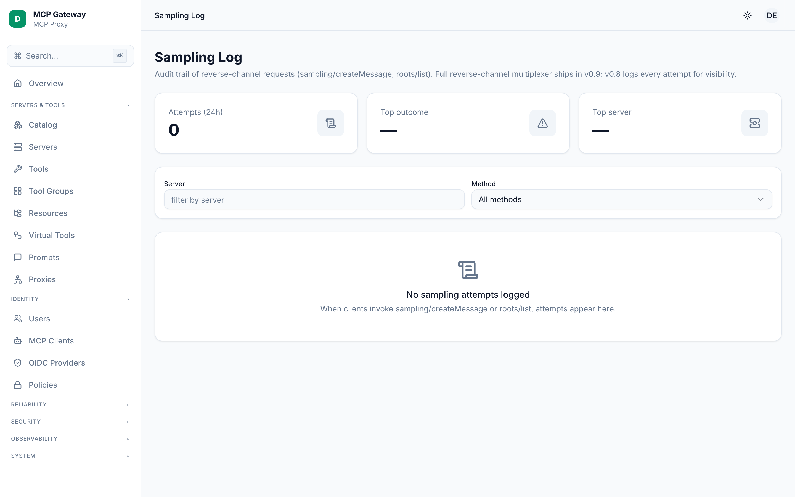
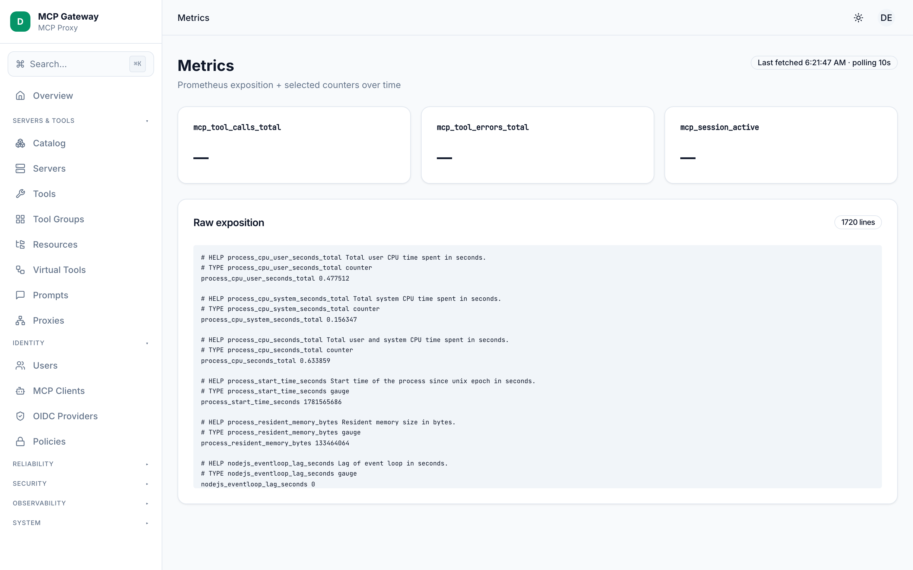
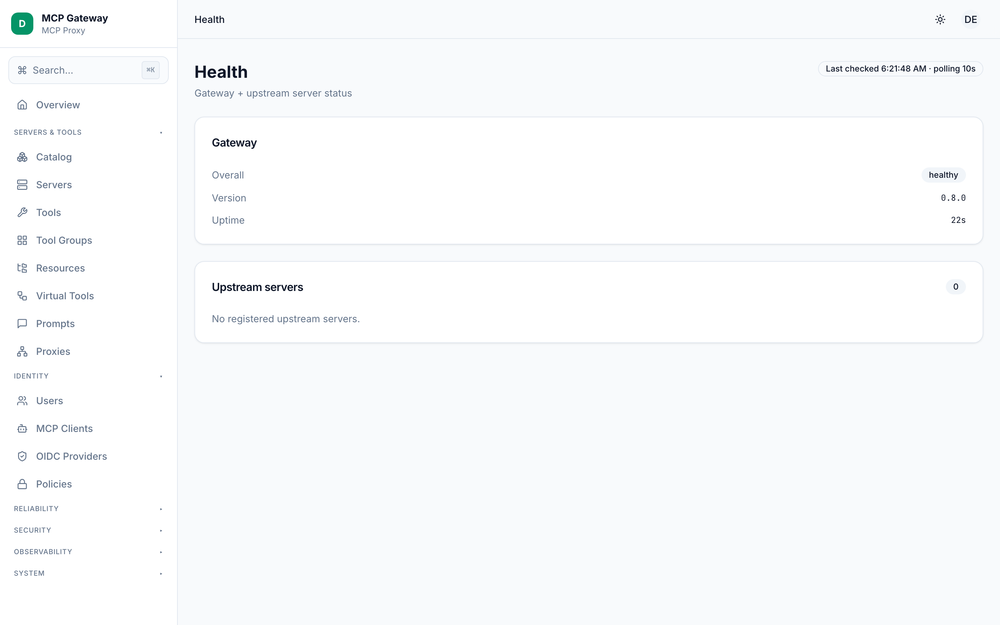

# Quan sát

Phần Quan sát trên dashboard MCP Gateway cung cấp năm màn hình để giám sát hoạt động của gateway: thống kê lệnh gọi công cụ tổng hợp, nhật ký sự kiện kiểm tra chi tiết, audit trail cho reverse-channel sampling, số liệu Prometheus theo thời gian thực, và trạng thái sức khoẻ của gateway. Cùng nhau, chúng cho quản trị viên cái nhìn toàn diện về những gì đang diễn ra bên trong gateway và các upstream MCP server.

**Các màn hình trong phần này:**

- [Usage (Mức sử dụng)](#usage)
- [Audit (Kiểm tra)](#audit)
- [Sampling Log (Nhật ký Sampling)](#sampling-log)
- [Metrics (Số liệu)](#metrics)
- [Health (Sức khoẻ)](#health)

---

## Usage

Trang Usage hiển thị thống kê lệnh gọi công cụ tổng hợp trong một khoảng thời gian đã chọn, được nhóm theo tên công cụ, principal, hoặc upstream server. Đây là cách nhanh nhất để trả lời các câu hỏi như "công cụ nào được gọi nhiều nhất?" hoặc "principal nào tạo ra nhiều traffic nhất?"

### Cách sử dụng

1. Trên thanh công cụ phía trên bên phải, nhấn một trong các nút khoảng thời gian — **1h**, **24h**, **7d**, hoặc **30d** — để đặt cửa sổ nhìn lại. Trang làm mới ngay lập tức và tự cập nhật mỗi phút.
2. Dùng dropdown **Group by** (bên cạnh các nút khoảng thời gian) để xoay dữ liệu theo:
   - `By tool` — tổng hợp theo tên công cụ.
   - `By principal` — tổng hợp theo ID principal đã xác thực.
   - `By server` — tổng hợp theo tên upstream server.
3. **Biểu đồ vùng** hiển thị tối đa 12 mục (theo tổng số lệnh gọi) cho nhóm đã chọn. Di chuột qua bất kỳ cột nào để xem chi tiết `success`, `denied`, và `error`.
4. **Bảng All entries** bên dưới biểu đồ liệt kê mọi mục, sắp xếp theo tổng số lệnh gọi giảm dần. Mỗi dòng hiển thị:

   | Cột | Mô tả |
   |---|---|
   | Key | Tên công cụ, ID principal, hoặc tên server (tuỳ theo nhóm). |
   | `ok` | Lệnh gọi hoàn thành thành công. |
   | `deny` | Lệnh gọi bị từ chối bởi chính sách. |
   | `err` | Lệnh gọi dẫn đến lỗi. |
   | Total | Tổng tất cả kết quả. |

### Tham chiếu API

`GET /api/usage?since=<ms>&until=<ms>&by=tool|principal|server`

---

## Audit

Trang Audit hiển thị nhật ký có thể lọc các sự kiện gateway riêng lẻ — mọi lệnh gọi công cụ, quyết định chính sách, sự kiện xác thực, và hành động hệ thống mà gateway ghi lại. Đây là công cụ chính để điều tra các sự cố cụ thể.

### Cách sử dụng

1. Chọn khoảng thời gian bằng các nút **1h**, **24h**, hoặc **7d** ở góc trên bên phải.
2. Dùng dropdown **Result** để lọc sự kiện theo kết quả: `all`, `success`, `denied`, hoặc `error`.
3. Nhập vào trường **Search** để lọc sự kiện theo `principalId` hoặc `resource` (không phân biệt hoa thường, khớp một phần).
4. Nhập vào trường **Action filter** để khớp một chuỗi action cụ thể như `tool.call`. Trường chấp nhận bất kỳ chuỗi con nào.
5. Danh sách sự kiện hiển thị tối đa 200 sự kiện. Mỗi dòng hiển thị:

   | Cột | Mô tả |
   |---|---|
   | Timestamp | Thời điểm sự kiện xảy ra (thời gian tương đối). |
   | Action | Loại sự kiện, ví dụ: `tool.call`, `auth.login`. |
   | Principal | ID principal đã xác thực đã kích hoạt sự kiện. |
   | Resource | Tài nguyên mục tiêu (tên công cụ, đường dẫn endpoint, v.v.). |
   | Result | Badge `success`, `denied`, hoặc `error`. |

6. Nhấn vào bất kỳ dòng nào để mở bảng chi tiết đầy đủ, hiển thị metadata đã thu thập:

   | Trường | Mô tả |
   |---|---|
   | `HTTP` | Phương thức HTTP, đường dẫn, và mã trạng thái (đối với sự kiện có nguồn gốc HTTP). |
   | `MCP method` | Tên phương thức giao thức MCP. |
   | `Tool` | Tên công cụ cho sự kiện `tool.call`. |
   | `Target server` | Upstream server mà công cụ được định tuyến đến. |
   | `Authorization` | Quyết định chính sách và tên chính sách khớp. |
   | `IP address` | Địa chỉ IP của client nếu được thu thập. |
   | `User agent` | Chuỗi user agent của client. |
   | `Request ID` | ID tương quan để theo dõi chéo log. |
   | `Error` | Mã lỗi và thông báo cho sự kiện kết quả `error`. |

### Tham chiếu API

`GET /api/audit/events?since=<ms>&until=<ms>&action=<str>&principalId=<str>&result=success|denied|error&limit=<n>`

---

## Sampling Log

Trang Sampling Log hiển thị audit trail của các yêu cầu reverse-channel — cụ thể là các lệnh gọi phương thức MCP `sampling/createMessage` và `roots/list` bắt nguồn từ upstream server ngược về phía client kết nối. Vì bộ ghép kênh reverse-channel đầy đủ sẽ được triển khai trong phiên bản tương lai (v0.9), gateway v0.8 ghi lại mọi lần thử cho quản trị viên quan sát ngay cả khi không thể thực hiện yêu cầu. Do đó, nhật ký này có thể trống trên một gateway mới chưa có traffic MCP client thực tế.

### Cách sử dụng

1. Ba **stat card** ở đầu trang hiển thị:
   - **Attempts (24h)** — tổng số lần thử reverse-channel trong 24 giờ qua.
   - **Top outcome** — mã kết quả phổ biến nhất trong tất cả các lần thử.
   - **Top server** — upstream server tạo ra nhiều lần thử nhất.
2. Dùng trường **Server** để lọc mục nhập theo tên upstream server cụ thể (khớp chính xác hoặc một phần).
3. Dùng dropdown **Method** để lọc theo phương thức MCP cụ thể: `all`, `sampling/createMessage`, hoặc `roots/list`.
4. Danh sách mục nhập (24 giờ qua, tối đa 200 dòng) hiển thị mỗi lần thử với:

   | Cột | Mô tả |
   |---|---|
   | Timestamp | Thời điểm ghi lại lần thử (thời gian tương đối). |
   | Method | `sampling/createMessage` hoặc `roots/list`. |
   | Upstream server | Server MCP đã khởi tạo lệnh gọi reverse-channel. |
   | Principal | Principal liên kết với phiên client, nếu có. |
   | Outcome | Xem bảng bên dưới. |
   | Latency | Độ trễ khứ hồi tính bằng millisecond, nếu đo được. |

5. **Giá trị Outcome:**

   | Kết quả | Ý nghĩa |
   |---|---|
   | `success` | Yêu cầu được thực hiện thành công và phản hồi được trả về. |
   | `client_refused` | Client kết nối từ chối yêu cầu. |
   | `timeout` | Không nhận được phản hồi trong khoảng thời gian chờ. |
   | `error` | Xảy ra lỗi nội bộ khi xử lý yêu cầu. |
   | `method_not_supported` | Client hoặc gateway chưa hỗ trợ phương thức MCP này. |

### Tham chiếu API

- `GET /api/sampling-log?since=<ms>&serverName=<str>&outcome=<str>&method=<str>&principalId=<str>&limit=<n>`
- `GET /api/sampling-log/stats?since=<ms>`

---

## Metrics

Trang Metrics hiển thị endpoint số liệu Prometheus của gateway theo hai dạng: một bộ thẻ counter được theo dõi với biểu đồ sparkline theo thời gian thực, và toàn bộ nội dung text Prometheus thô. Trang thực hiện polling `/api/metrics` mỗi 10 giây.

### Cách sử dụng

1. Phần **thẻ counter được theo dõi** hiển thị giá trị thời gian thực của ba counter chính, mỗi cái với sparkline cuộn 30 mẫu:

   | Counter | Mô tả |
   |---|---|
   | `mcp_tool_calls_total` | Tổng số lệnh gọi công cụ được gateway xử lý (tích luỹ). |
   | `mcp_tool_errors_total` | Tổng số lệnh gọi công cụ dẫn đến lỗi (tích luỹ). |
   | `mcp_session_active` | Số lượng phiên MCP đang hoạt động hiện tại (gauge). |

2. Thẻ **Raw exposition** bên dưới các counter hiển thị toàn bộ đầu ra text Prometheus từ `/api/metrics`. Số dòng được hiển thị trong tiêu đề thẻ. Bạn có thể sao chép văn bản này để đưa vào bất kỳ trình scraper tương thích Prometheus hoặc hệ thống giám sát nào.
3. Badge **Last fetched** trên tiêu đề trang hiển thị thời điểm poll thành công gần nhất.
4. Nếu endpoint `/api/metrics` không khả dụng (ví dụ: metrics bị tắt trong cấu hình gateway), thông báo trạng thái trống sẽ được hiển thị thay thế.

### Tham chiếu API

`GET /api/metrics` — trả về nội dung text Prometheus (`Content-Type: text/plain; version=0.0.4`).

**Mẹo:** Để scrape số liệu bằng Prometheus, thêm scrape target trỏ đến `http://<gateway-host>/api/metrics`. Không cần header xác thực nếu gateway được triển khai sau ranh giới mạng; thêm bearer token qua cấu hình `authorization` của Prometheus nếu admin API được công khai.

---

## Health

Trang Health hiển thị trạng thái sức khoẻ tổng thể của tiến trình gateway và trạng thái kết nối của mọi upstream MCP server đã đăng ký. Trang thực hiện polling `/api/health` mỗi 10 giây.

### Cách sử dụng

1. Thẻ **Gateway** ở đầu trang báo cáo ba trường:

   | Trường | Mô tả |
   |---|---|
   | `Overall` | Trạng thái sức khoẻ tổng thể: `healthy`, `degraded`, hoặc `unhealthy`. |
   | `Version` | Chuỗi phiên bản gateway (ví dụ: `v0.8.0`). |
   | `Uptime` | Thời gian từ khi tiến trình gateway khởi động (ví dụ: `2h 14m`). |

2. Thẻ **Upstream servers** liệt kê mọi server đã đăng ký với gateway. Mỗi dòng hiển thị:

   | Cột | Mô tả |
   |---|---|
   | Server name | Tên đã cấu hình của upstream MCP server. |
   | Transport | Loại transport kết nối (ví dụ: `stdio`, `sse`, `streamable-http`). |
   | Status | Badge `healthy`, `degraded`, hoặc `unhealthy` với chấm màu trạng thái. |

3. Badge **Last checked** trên tiêu đề trang hiển thị giờ địa phương của lần poll gần nhất.
4. Nếu endpoint `/api/health` không thể truy cập, thông báo trạng thái trống sẽ được hiển thị.
5. Endpoint trả về HTTP `503` khi trạng thái tổng thể là `unhealthy`, phù hợp để làm load-balancer hoặc target liveness/readiness probe của Kubernetes.

### Tham chiếu API

`GET /api/health` — trả về JSON với các trường `status`, `version`, `uptime` (giây), và mảng `servers`. Trả về HTTP `200` khi `healthy` hoặc `degraded`, `503` khi `unhealthy`.

---

## Xem thêm

- [Kiến trúc](./architecture.md)
- [Độ tin cậy](./reliability.md)
- [Bảo mật](./security.md)
- [Hệ thống](./system.md)
